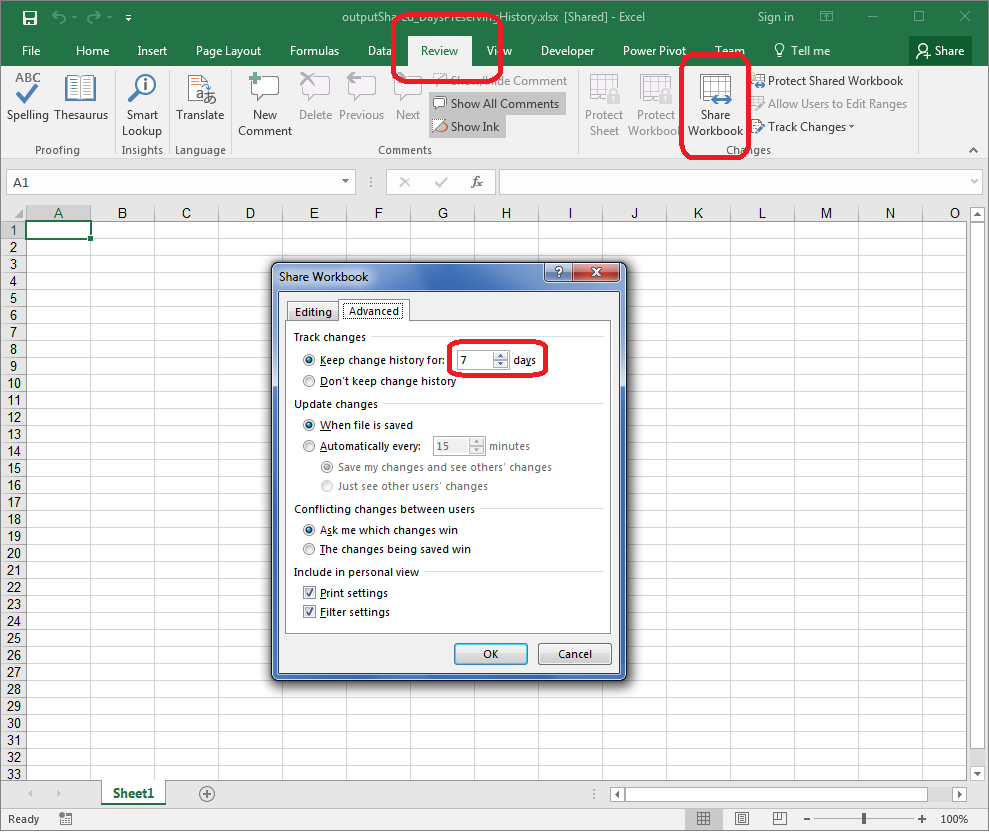

## **Possible Usage Scenarios**

When you share a workbook, you get an option saying ***Keep change history for N days*** as shown in the following screenshot. You can update the number of days for preserving history using Aspose.Cells with [**WorksheetCollection.GetDaysPreservingHistory()**](https://reference.aspose.com/cells/cpp/aspose.cells.revisions/revisionlogcollection/getdayspreservinghistory/) property.



## **Update Days Preserving History of Revision Logs in Shared Workbook**

The following sample code creates an empty workbook, then shares it and updates the revision logs days preserving history to 7 days which is normally 30 days. Please see the [output Excel file](60489773.xlsx) generated by the code for a reference.

## **Sample Code**

```c++
#include <iostream>
#include "Aspose.Cells.h"
using namespace Aspose::Cells;

int main()
{
    Aspose::Cells::Startup();

    // Create empty workbook
    Workbook wb;

    // Share the workbook
    wb.GetSettings().SetShared(true);

    // Update DaysPreservingHistory of RevisionLogs
    wb.GetWorksheets().GetRevisionLogs().SetDaysPreservingHistory(7);

    // Save the workbook
    wb.Save(u"outputShared_DaysPreservingHistory.xlsx");

    std::cout << "Workbook shared and saved successfully!" << std::endl;

    Aspose::Cells::Cleanup();
}
```

