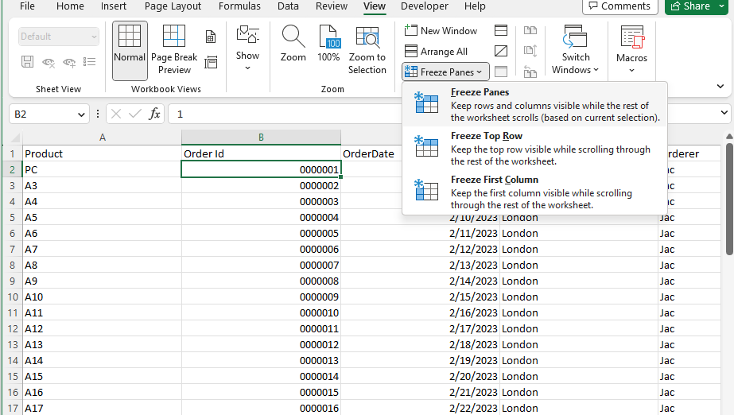
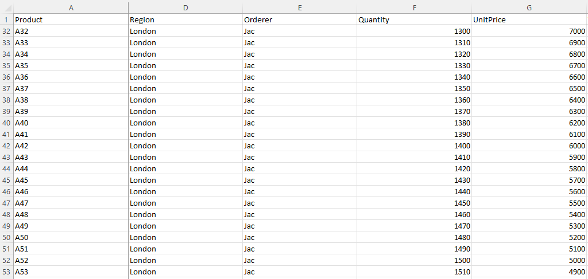

## **Introduction**

In this article, we will learn how to freeze panes. When you have a huge amount of data under a common heading, you are unable to see the heading when you scroll down the worksheet. Each record contains many data points. You can freeze panes so that you can see the frozen portion even when the rest of the data is scrolled. You can easily see headers in the top rows or first columns. Freezing and unfreezing panes only changes the view of the data without changing the data itself.

## **In Excel**

****

1. If you want to freeze rows and columns, first select a cell (such as B2).  
2. Click **View > Freeze Panes**.  
3. On the drop‑down menu, click **Freeze Panes**.  
4. If you scroll down or to the right, the first row and column are frozen.

****

As you can see, the 1st row and column A are frozen, the second row is 2, and the second visible column is D.

Freeze panes let you view large data without having to keep track of row or column labels.

## **Freeze Panes with Aspose.Cells for C++**

It’s simple to freeze panes with Aspose.Cells for C++. Please use the **Worksheet.FreezePanes** method to freeze panes at the selected cell.

1. Construct a Workbook to open an existing file or create a new one.  
2. Freeze panes with the `Worksheet.FreezePanes()` method.  
3. Save the file.

```cpp
#include <iostream>
#include "Aspose.Cells.h"
using namespace Aspose::Cells;

int main()
{
    Aspose::Cells::Startup();

    // Instantiate a new Workbook
    U16String inputFilePath(u"Freeze.xlsx");
    Workbook workbook(inputFilePath);

    // Freeze panes at the cell B2
    WorksheetCollection sheets = workbook.GetWorksheets();
    sheets.Get(0).FreezePanes(u"B2", 1, 1);

    // Save the file
    U16String outputFilePath(u"frozen.xlsx");
    workbook.Save(outputFilePath);

    std::cout << "Panes frozen successfully!" << std::endl;

    Aspose::Cells::Cleanup();
}
```

Attached [sample source Excel file](Freeze.xlsx).  

