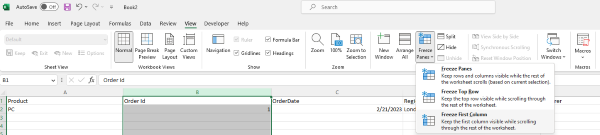

## **Introduction**

In this article, we will learn how to freeze left column(s). When you have a huge amount of data in a row, you are unable to see the left columns when horizontally scrolled across the worksheet. You can freeze and lock the first column(s) so that you can see that frozen portion even when the rest of the data is being scrolled. You can easily see headers in the left columns.

## **Freeze Columns In Excel**

****

1. If you want to freeze left column(s), first select the column to the right of the column that needs to be frozen.  
2. Click **View > Freeze Panes**.  
3. On the drop‑down menu, click **Freeze First Column**.  
4. If you scroll horizontally, the first column remains in view.

****

As you can see, the 1st column is frozen; the first column is always locked at the left side of the view when you scroll horizontally.

Freeze columns let you view your wide data without losing sight of the first column.

## **Freeze Columns with Aspose.Cells for C++**
It's simple to freeze the first column(s) with Aspose.Cells for C++. Please use the [**Worksheet.FreezePanes**](https://reference.aspose.com/cells/cpp/aspose.cells/worksheet/freezepanes/) method to freeze column(s) at the selected column.

1. Construct a Workbook to open an existing file or create a new one.  
2. Freeze the first column with the `Worksheet.FreezePanes()` method.  
3. Save the file.

```c++
#include <iostream>
#include "Aspose.Cells.h"
using namespace Aspose::Cells;

int main()
{
    Aspose::Cells::Startup();

    // Instantiate a new Workbook
    Workbook workbook(u"Freeze.xlsx");

    // Freezing panes at the second column
    workbook.GetWorksheets().Get(0).FreezePanes(u"B1", 0, 1);

    // Saving the file
    workbook.Save(u"frozen.xlsx");

    std::cout << "Panes frozen successfully!" << std::endl;

    Aspose::Cells::Cleanup();
}
```

Attached [sample source Excel file](Freeze.xlsx).  

