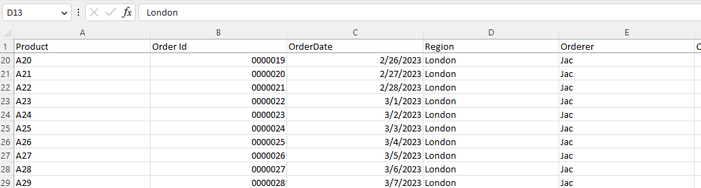

## **Introduction**

In this article, we will learn how to freeze top row(s). When you have a huge amount of data under a common heading, you are unable to see the heading when you scroll down the worksheet. You can freeze top row(s) so that you can see that frozen portion even when the rest of the data is scrolled. You can easily see headers in the top rows.

## **Freeze Rows In Excel**

****

1. If you want to freeze top row(s), first select the row below the rows that need to be frozen.  
2. Click **View > Freeze Panes**.  
3. On the drop‑down menu, click **Freeze Top Row**.  
4. If you scroll down, the first row is always in the top view.

****

As you can see, the first row is frozen, and the first row always stays at the top of the view while you scroll down.

Freeze rows let you view large data without losing track of the row labels.

## **Freeze Rows with Aspose.Cells for C++**
It's simple to freeze row(s) with Aspose.Cells for C++.  
Please use the [**Worksheet.FreezePanes**](https://reference.aspose.com/cells/cpp/aspose.cells/worksheet/freezepanes/) method to freeze row(s) at the selected row.

1. Construct a Workbook to open a file or create a new empty file.  
2. Freeze the first row with the `Worksheet.FreezePanes()` method.  
3. Save the file.

```c++
#include <iostream>
#include "Aspose.Cells.h"
using namespace Aspose::Cells;

int main()
{
    Aspose::Cells::Startup();

    // Instantiate a new Workbook
    Workbook workbook(u"Freeze.xlsx");

    // Freezing panes at the cell A2
    workbook.GetWorksheets().Get(0).FreezePanes(u"A2", 1, 0);

    // Saving the file
    workbook.Save(u"frozen.xlsx");

    std::cout << "Panes frozen successfully!" << std::endl;

    Aspose::Cells::Cleanup();
}
```

Attached [sample source Excel file](../Freeze.xlsx).  

