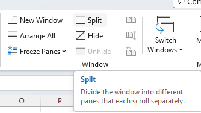

## **Introduction**

In this article, we will learn how to display certain rows and/or columns in separate panes by splitting the worksheet into two or four parts. When working with large datasets, we need to see a few areas of the same worksheet at a time to compare different subsets of data. The split screen function can meet your needs.

## **How to split screen in Excel**
To split up a worksheet into two or four parts, do as the following:

1. Select the row/column/cell before which you want to place the split.
2. On the View tab, in the Windows group, click the Split button.

****

## **Split worksheet vertically on columns**

To separate two areas of the spreadsheet vertically, select the column to the right of the column where you wish the split to appear and click the Split button in Excel.

It's easy to split worksheet vertically on columns programmatically with Aspose.Cells for C++, we only need to select one cell in the top row as active cell, then
split with [**Worksheet.Split**](https://reference.aspose.com/cells/cpp/aspose.cells/worksheet/split/) method.

```c++
#include <iostream>
#include "Aspose.Cells.h"
using namespace Aspose::Cells;

int main()
{
    Aspose::Cells::Startup();

    // Instantiate a new Workbook.
    Workbook workbook(u"Book1.xlsx");

    // Get the first worksheet in the workbook.
    Worksheet sheet = workbook.GetWorksheets().Get(0);

    // Sets C1 cell in the top row as the active cell.
    sheet.SetActiveCell(u"C1");

    // Split worksheet vertically on columns.
    sheet.Split();

    std::cout << "Worksheet processed successfully!" << std::endl;

    Aspose::Cells::Cleanup();
    return 0;
}
```

## **Split worksheet horizontally on rows**
To separate your Excel window horizontally, select the row below the row where you want the split to occur in Excel.

It's easy to split worksheet horizontally on rows programmatically with Aspose.Cells for C++, we only need to select one cell in the left column as active cell, then
split with [**Worksheet.Split**](https://reference.aspose.com/cells/cpp/aspose.cells/worksheet/split/) method.

```c++
#include <iostream>
#include "Aspose.Cells.h"
using namespace Aspose::Cells;

int main()
{
    Aspose::Cells::Startup();

    // Create a new workbook and load an existing Excel file.
    Workbook workbook(u"Book1.xlsx");

    // Access the first worksheet in the workbook.
    Worksheet sheet = workbook.GetWorksheets().Get(0);

    // Set the A6 cell in the left column as the active cell.
    sheet.SetActiveCell(u"A6");

    // Split the worksheet horizontally on rows.
    sheet.Split();

    // Save the modified workbook to a new file.
    workbook.Save(u"dest.xlsx");

    std::cout << "Workbook processed and saved successfully!" << std::endl;

    Aspose::Cells::Cleanup();
    return 0;
}
```

## **Split worksheet into four parts**
To view four different sections of the same worksheet simultaneously, split your screen both vertically and horizontally in Excel.

It's easy to split worksheet vertically on columns programmatically with Aspose.Cells for C++, we only need to select one cell not in the first row and column as active cell, then
split with [**Worksheet.Split**](https://reference.aspose.com/cells/cpp/aspose.cells/worksheet/split/) method.

```c++
#include <iostream>
#include "Aspose.Cells.h"
using namespace Aspose::Cells;

int main()
{
    Aspose::Cells::Startup();

    // Instantiate a new Workbook.
    Workbook workbook(u"Book1.xlsx");

    // Get the first worksheet.
    Worksheet sheet = workbook.GetWorksheets().Get(0);

    // Set E6 cell as the active cell.
    sheet.SetActiveCell(u"E6");

    // Split worksheet into four parts.
    sheet.Split();

    Aspose::Cells::Cleanup();
}
```

## **How to remove split**
To remove the worksheet splitting, just click the Split button again.

Aspose.Cells for C++ provides a [**Worksheet.RemoveSplit**](https://reference.aspose.com/cells/cpp/aspose.cells/worksheet/removesplit/) method to remove split setting.

```c++
#include <iostream>
#include "Aspose.Cells.h"
using namespace Aspose::Cells;

int main()
{
    Aspose::Cells::Startup();

    // Instantiate a new Workbook
    Workbook workbook(u"Book1.xlsx");

    // Get the first worksheet
    Worksheet sheet = workbook.GetWorksheets().Get(0);

    // Remove split
    sheet.RemoveSplit();

    // Split worksheet into four parts
    sheet.Split();

    std::cout << "Worksheet split successfully!" << std::endl;

    Aspose::Cells::Cleanup();
}
```

