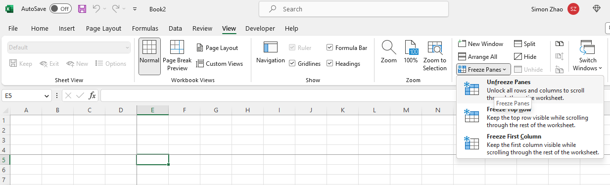

## **Introduction**

In this article, we will learn how to unfreeze rows, columns, and panes in Excel worksheets. If worksheets in Excel files are frozen, sometimes we want to unfreeze the worksheet or adjust frozen rows, columns, or panes.

## **In Excel**

1. Click the **View** tab > **Freeze Panes** > **Unfreeze Panes**.

****

## **Unfreeze Rows, Columns, or Panes with Aspose.Cells for C++**
It's simple to unfreeze panes with Aspose.Cells for C++. Use the [**Worksheet.UnFreezePanes**](https://reference.aspose.com/cells/cpp/aspose.cells/worksheet/unfreezepanes/) method to unfreeze panes.

1. Construct a `Workbook` object to open the frozen file.
2. Unfreeze panes using the `Worksheet.UnFreezePanes()` method.
3. Save the file.

```c++
#include <iostream>
#include "Aspose.Cells.h"

using namespace Aspose::Cells;

int main()
{
    Aspose::Cells::Startup();

    // Instantiate a new Workbook
    U16String inputFilePath(u"Frozen.xlsx");
    Workbook workbook(inputFilePath);

    // Unfreeze panes in the first worksheet
    workbook.GetWorksheets().Get(0).UnFreezePanes();

    // Save the modified workbook
    U16String outputFilePath(u"Unfrozen.xlsx");
    workbook.Save(outputFilePath);

    std::cout << "Panes unfrozen successfully!" << std::endl;

    Aspose::Cells::Cleanup();
}
```

Attached [sample source Excel file](Frozen.xlsx).