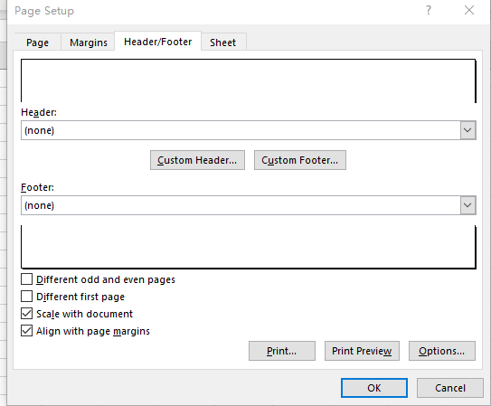

{}

MS Excel supports setting different headers and footers for the first page, odd pages, and even pages since Excel 2007.
Aspose.Cells supports the same feature.

{}

## **Setting Different Headers and Footers in MS Excel**

****

1. Click **Page Layout > Print Titles > Header/Footer**.
1. Check **Different Odd and Even Pages** or **Different First Page**.
1. Enter different headers and footers.

## **Setting Different Headers and Footers with Aspose.Cells**

Aspose.Cells behaves the same as Excel.
1. Sets the flags [PageSetup.IsHFDiffOddEven](https://reference.aspose.com/cells/cpp/aspose.cells/pagesetup/ishfdiffoddeven/) and [PageSetup.IsHFDiffFirst](https://reference.aspose.com/cells/cpp/aspose.cells/pagesetup/ishfdifffirst/) 
1. Enter different headers and footers.

```cpp
#include <iostream>
#include "Aspose.Cells.h"
using namespace Aspose::Cells;

int main()
{
    Aspose::Cells::Startup();

    // Create a new workbook
    Workbook wb;

    // Get the first worksheet's page setup
    PageSetup pageSetup = wb.GetWorksheets().Get(0).GetPageSetup();

    // Set different headers for odd and even pages
    pageSetup.SetIsHFDiffOddEven(true);
    pageSetup.SetHeader(1, u"I am the header of the Odd page.");
    pageSetup.SetEvenHeader(1, u"I am the header of the Even page.");

    // Set a different header for the first page
    pageSetup.SetIsHFDiffFirst(true);
    pageSetup.SetFirstPageHeader(1, u"I am the header of the First page.");

    Aspose::Cells::Cleanup();
}
```

