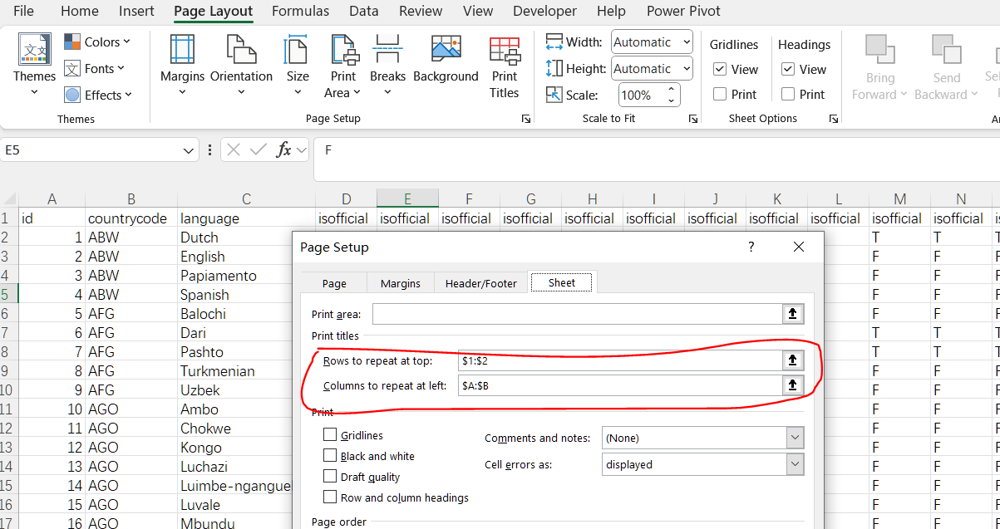

## **Possible Usage Scenarios**

Setting print titles in Excel ensures that specific rows or columns are repeated on every printed page, which is especially useful for large spreadsheets that span multiple pages. Here are some reasons why you might set print titles:

1. Enhanced Readability: Print titles help readers understand the data by keeping headers visible on all pages, making it easier to interpret the information on each page without having to refer back to the first page.

1. Professional Presentation: Consistently displaying headers or labels on each page creates a more polished and professional appearance for printed documents.

1. Improved Navigation: For documents with extensive data, repeating the headers on each page allows for quicker navigation and reference, reducing the need to flip back and forth between pages.

1. Reduced Errors: When headers are present on every page, it minimizes the chances of misinterpretation or data entry errors, as users can easily see the context of the data.

1. Consistency: Ensuring that important information, such as column headers or row labels, is always visible maintains consistency and clarity throughout the document.

## **How to Set Print Titles in Excel**

To set print titles in Excel, follow these steps:

1. Open the Page Layout Tab: Click on the "Page Layout" tab in the ribbon at the top of the Excel window.
1. Access Print Titles: In the "Page Setup" group, click on "Print Titles".
1. Set Rows to Repeat: In the "Page Setup" dialog box, go to the "Sheet" tab. In the "Print titles" section, specify the rows to repeat at the top by clicking the box next to "Rows to repeat at top" and selecting the row(s) you want to repeat.
1. Set Columns to Repeat (if needed): Similarly, you can specify the columns to repeat at the left by clicking the box next to "Columns to repeat at left" and selecting the column(s) you want to repeat.
<br>


1. Confirm and Print: Click "OK" to apply the settings. When you print the worksheet, the specified rows or columns will appear on every printed page.

## **How to Clear Print Titles in Excel**

To clear print titles in Excel, you need to remove the rows or columns that are set to repeat on every printed page. Here’s how to do it:

1. Open the Page Layout Tab: Click on the "Page Layout" tab in the ribbon at the top of the Excel window.
1. Access Print Titles: In the "Page Setup" group, click on "Print Titles".
1. Clear Print Titles: In the "Page Setup" dialog box, go to the "Sheet" tab. Clear the text boxes for "Rows to repeat at top" and "Columns to repeat at left" by deleting any content inside them.
<br>


1. Confirm and Close: Click "OK" to apply the changes.

## **How to Set Print Titles Using Aspose.Cells**

To set print titles in a specified worksheet: First, load the [sample file](input.xlsx), and then you need to modify the [**Worksheet.GetPrintTitleRows()**](https://reference.aspose.com/cells/cpp/aspose.cells/pagesetup/getprinttitlerows/) and [**Worksheet.GetPrintTitleColumns()**](https://reference.aspose.com/cells/cpp/aspose.cells/pagesetup/getprinttitlecolumns/) properties of the [**PageSetup**](https://reference.aspose.com/cells/cpp/aspose.cells/pagesetup/) object for the desired worksheet. Setting these properties to a range string will set the print titles.

```cpp
#include <iostream>
#include "Aspose.Cells.h"

using namespace Aspose::Cells;

int main()
{
    Aspose::Cells::Startup();

    // Load the workbook
    Workbook workbook(u"input.xlsx");

    // Access the desired worksheet
    Worksheet worksheet = workbook.GetWorksheets().Get(0);

    // Set rows to repeat at the top (e.g., rows 1 and 2)
    worksheet.GetPageSetup().SetPrintTitleRows(u"$1:$2");

    // Set columns to repeat at the left (e.g., columns A and B)
    worksheet.GetPageSetup().SetPrintTitleColumns(u"$A:$B");

    // Save the workbook
    workbook.Save(u"set_print_titles.pdf");

    std::cout << "Print titles set successfully!" << std::endl;

    Aspose::Cells::Cleanup();
}
```

The output result:
<br>


## **How to Clear Print Titles Using Aspose.Cells**

To clear the print titles in a specified worksheet: First, load the [sample file](input.xlsx), and then you need to modify the [**Worksheet.GetPrintTitleRows()**](https://reference.aspose.com/cells/cpp/aspose.cells/pagesetup/getprinttitlerows/) and [**Worksheet.GetPrintTitleColumns()**](https://reference.aspose.com/cells/cpp/aspose.cells/pagesetup/getprinttitlecolumns/) properties of the [**PageSetup**](https://reference.aspose.com/cells/cpp/aspose.cells/pagesetup/) object for the desired worksheet. Setting these properties to an empty string will clear the print titles.

```cpp
#include <iostream>
#include "Aspose.Cells.h"

using namespace Aspose::Cells;

int main()
{
    Aspose::Cells::Startup();

    // Load the workbook
    U16String inputFilePath = u"input.xlsx";
    Workbook workbook(inputFilePath);

    // Access the desired worksheet
    WorksheetCollection sheets = workbook.GetWorksheets();
    Worksheet worksheet = sheets.Get(0);

    // Clear the rows and columns set to repeat
    PageSetup pageSetup = worksheet.GetPageSetup();
    pageSetup.SetPrintTitleRows(u"");
    pageSetup.SetPrintTitleColumns(u"");

    // Save the workbook
    U16String outputFilePath = u"clear_print_titles.pdf";
    workbook.Save(outputFilePath);

    Aspose::Cells::Cleanup();
}
```

The output result:
<br>


