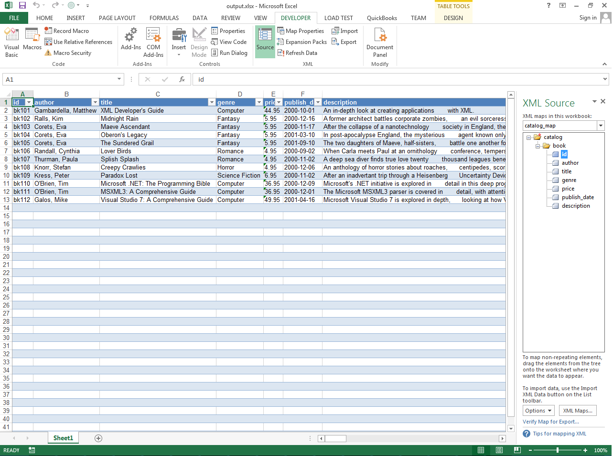

{}

Aspose.Cells allows you to import the XML map inside the workbook using the [**Workbook.ImportXml()**](https://reference.aspose.com/cells/cpp/aspose.cells/workbook/importxml/) method. You can import XML Map using Microsoft Excel with the following steps:

- Select the **Developer** tab.
- Click **Import** in the XML section and follow the required steps.

You will need to provide your XML data to complete the import. Here is a [sample XML data](5115037.txt) that you can use for testing.

{}

## **Import XML Map using Microsoft Excel**

The following screenshot shows how to import XML Map using Microsoft Excel.

||
| :- |

## **Import XML Map using Aspose.Cells**

The following sample code shows how to use the [**Workbook.ImportXml()**](https://reference.aspose.com/cells/cpp/aspose.cells/workbook/importxml/) method. It generates the [output Excel file](5115036.xlsx) as shown in this screenshot.

||
| :- |

```c++
#include <iostream>
#include "Aspose.Cells.h"
using namespace Aspose::Cells;

int main()
{
    Aspose::Cells::Startup();

    // Source directory path
    U16String srcDir(u"..\\Data\\01_SourceDirectory\\");

    // Output directory path
    U16String outDir(u"..\\Data\\02_OutputDirectory\\");

    // Create a workbook
    Workbook workbook;

    // URL that contains your XML data for mapping
    U16String XML(u"http://www.aspose.com/docs/download/attachments/434475650/sampleXML.txt");

    // Import your XML Map data starting from cell A1
    workbook.ImportXml(XML, u"Sheet1", 0, 0);

    // Save workbook
    U16String outputPath = outDir + u"output_out.xlsx";
    workbook.Save(outputPath);

    std::cout << "Workbook saved successfully with imported XML data!" << std::endl;

    Aspose::Cells::Cleanup();
}
```

## **Advanced Topics**
- [Add XML Map inside the Workbook using XmlMapCollection.Add method](/cells/cpp/add-xml-map-inside-the-workbook-using-xmlmapcollection-add-method/)
- [Export XML Data linked to XML Map inside the Workbook](/cells/cpp/export-xml-data-linked-to-xml-map-inside-the-workbook/)
- [Find the Root Element Name of XML Map](/cells/cpp/find-the-root-element-name-of-xml-map/)
- [Link Cells to XML Map Elements](/cells/cpp/link-cells-to-xml-map-elements/)