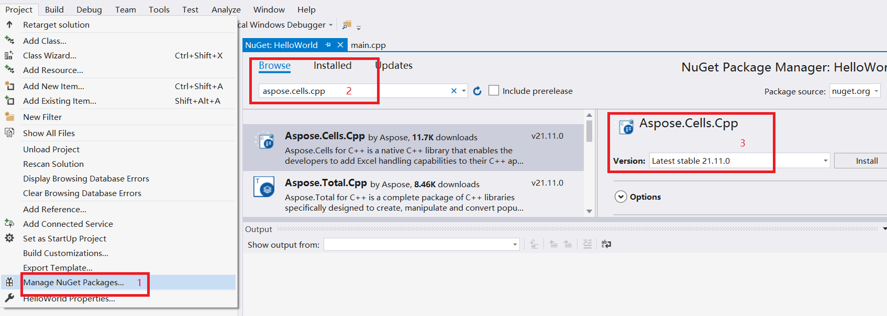

{} 

This page will show you how to install Aspose Cells for C++ and create a Hello World application.

{}

## **Installation**

### **Install Aspose Cells through NuGet**

NuGet is the easiest way to download and install Aspose.Cells for C++. 
1. Create a Microsoft Visual Studio project for C++.
2. Include header file "Aspose.Cells.h".
3. Open Microsoft Visual Studio and NuGet package manager.
4. Search "aspose.cells.cpp" to find the desired Aspose.Cells for C++. 
5. Click on "Install", Aspose.Cells for C++ will be downloaded and referenced in your project.

****

You can also download it from the nuget web page for aspose.cells: 
[Aspose.Cells for C++ NuGet Package](https://www.nuget.org/packages/Aspose.Cells.Cpp/)

[More step for details](/cells/cpp/installation/)

### **A demo for using Aspose.Cells for C++ on Windows**

1. Download Aspose.Cells for C++ from the following page:
[Download Aspose.Cells for C++(Windows)](https://downloads.aspose.com/cells/cpp/)
2. Unzip the package and you will find a example which is on how to use Aspose.Cells for C++.
3. Open the example.sln with Visual Studio 2017 or higher version
4. main.cpp: this file shows how to code to test Aspose.Cells for C++

### **A demo for using Aspose.Cells for C++ on Linux**

1. Download Aspose.Cells for C++ from the following page:
[Download Aspose.Cells for C++(Linux)](https://downloads.aspose.com/cells/cpp/)
2. Unzip the package and you will find a example which is on how to use Aspose.Cells for C++ for Linux.
3. Make sure you are in the path where example is located.
4. Run "cmake -S example -B example/build -DCMAKE_BUILD_TYPE=Release"
5. Run "cmake --build example/build"

### **A demo for using Aspose.Cells for C++ on Mac OS**

1. Download Aspose.Cells for C++ from the following page:
[Download Aspose.Cells for C++(MacOS)](https://downloads.aspose.com/cells/cpp/)
2. Unzip the package and you will find a example which is on how to use Aspose.Cells for C++ for MacOS.
3. Make sure you are in the path where example is located.
4. Run "cmake -S example -B example/build -DCMAKE_BUILD_TYPE=Release"
5. Run "cmake --build example/build"

## **Creating the Hello World Application**

The steps below creates the Hello World application using the Aspose.Cells API:

1. Create an instance of the [Workbook](https://reference.aspose.com/cells/cpp/aspose.cells/workbook/) class.
1. If you have a license, then [apply it](/cells/cpp/licensing/).
   If you are using the evaluation version, skip the license related code lines.
1. Access any desired cell of a worksheet in the Excel file.
1. Insert the words "**Hello World!**" into a cell accessed.
1. Generate the modified Microsoft Excel file.

The implementation of the above steps is demonstrated in the examples below.

### **Code Sample: Creating a New Workbook**

The following example creates a new workbook from the scratch, inserts "**Hello World!**" into cell A1 on the first worksheet and saves the Excel file.



### **Code Sample: Opening an Existing File**

The following example opens an existing Microsoft Excel template file, gets a cell and checks the value in the cell A1.


