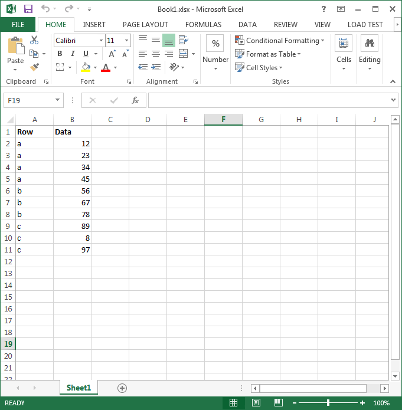

{}

This article explains how to apply subtotal to data and change the direction of outline summary rows below detail.

You can apply subtotal to data using the [**Worksheet.Cells.Subtotal()**](https://reference.aspose.com/cells/go-cpp/cells/subtotal_cellarea_int_consolidationfunction_int32array/) method. It takes the following parameters:

- **CellArea** – The range to which the subtotal is applied
- **GroupBy** – The field to group by, as a zero‑based integer offset
- **Function** – The subtotal function
- **TotalList** – An array of zero‑based field offsets indicating the fields to which the subtotals are added
- **Replace** – Indicates whether to replace the current subtotals
- **PageBreaks** – Indicates whether to add page breaks between groups
- **SummaryBelowData** – Indicates whether to add a summary below the data

You can also control the direction of outline **summary rows below detail** as shown in the following screenshot by using the `Worksheet.Outline.SummaryRowBelow` property. This setting can be opened in Microsoft Excel via **Data > Outline > Settings**.

{}

## Images of source and output files

The following screenshot shows the source Excel file used in the sample code below, which contains some data in columns A and B.

The following screenshot shows the output Excel file generated by the sample code. As you can see, subtotal has been applied to range A2:B11, and the outline direction is set to summary rows below detail.

## C++ code to apply subtotal and change the direction of outline summary rows

Here is the sample code to achieve the output shown above.

