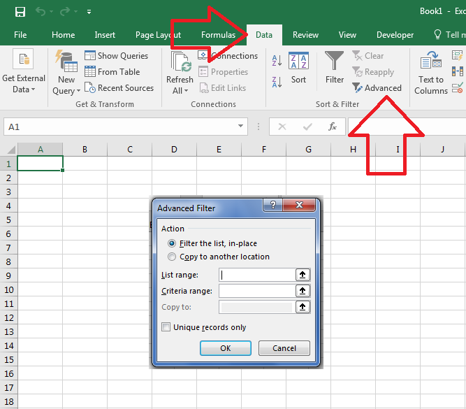
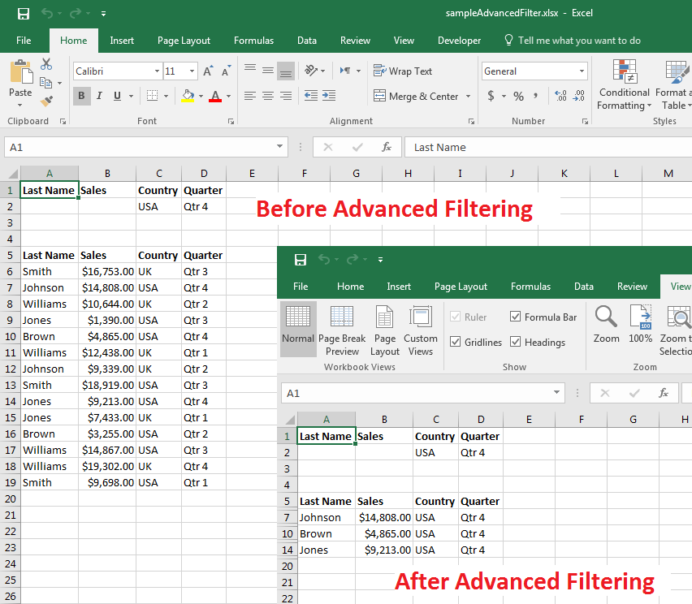

## **Possible Usage Scenarios**

Microsoft Excel allows you to apply *Advanced Filter* on worksheet data to display records that meet complex criteria. You can apply Advanced Filter with Microsoft Excel via its *Data > Advanced* command as shown in this screenshot.

Aspose.Cells also allows you to apply the Advanced Filter using the [**GetAdvancedFilter()**](https://reference.aspose.com/cells/go-cpp/worksheet/getadvancedfilter/) method. Just like Microsoft Excel, it accepts the following parameters.

**isFilter**

Indicates whether filtering the list in place.

**listRange**

The list range.

**criteriaRange**

The criteria range.

**copyTo**

The range where copying data to.

**uniqueRecordOnly**

Only displaying or copying unique rows.

## **Apply Advanced Filter of Microsoft Excel to Display Records Meeting Complex Criteria**

The following sample code applies the advanced filter on the [Sample Excel File](48496692.xlsx) and generates the [Output Excel File](48496691.xlsx). The screenshot shows both files for comparison. As you can see inside the screenshot, data has been filtered inside the output Excel file according to complex criteria.

## **Sample Code**

