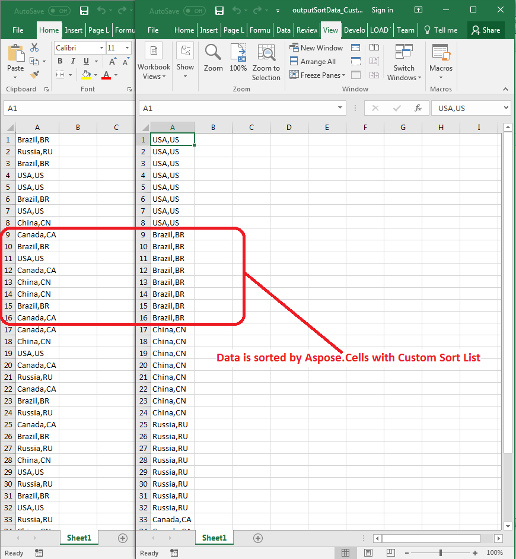

## **Possible Usage Scenarios**

You can sort data in the column using a custom list. This can be done using [**DataSorter::AddKey(int key, SortOrder order, String customList)**](https://reference.aspose.com/cells/go-cpp/datasorter/addkey_int_sortorder/) method. However, this method works only if the items in the custom list do not have commas inside them. If they have commas like "USA,US", "China,CN", etc., then you must use the [**DataSorter::AddKey Method (Int32, SortOrder, String[])**](https://reference.aspose.com/cells/go-cpp/datasorter/addkey_int_sortorder/) method. Here, the last parameter is not a `String` but an array of strings.

## **Sort Data in Column with Custom Sort List**

The following sample code explains how to use the [**DataSorter::AddKey Method (Int32, SortOrder, String[])**](https://reference.aspose.com/cells/go-cpp/datasorter/addkey_int_sortorder/) method to sort data with a custom sort list. Please see the [sample Excel file](50528327.xlsx) used in this code and the [output Excel file](50528328.xlsx) generated by it. The following screenshot shows the effect of the code on the sample Excel file when executed.

## **Sample Code**

