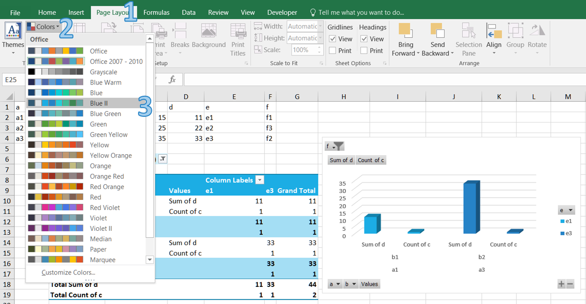
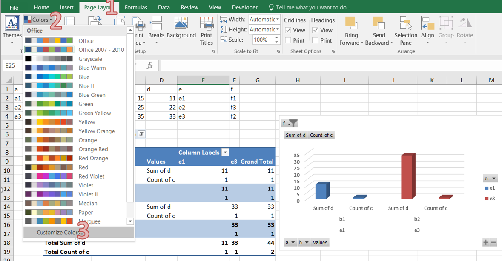
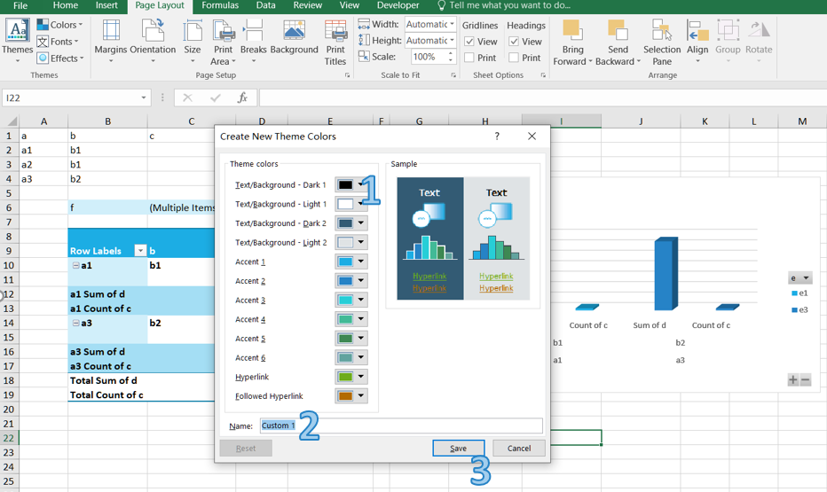

## **How to Apply and Create Color Scheme in Excel**
Document themes make it easy to coordinate colors, fonts, and graphic formatting effects of Excel documents and update them quickly.  
Themes provide a unified look with named styles, graphical effects and other objects used in a workbook. For example, the Accent1 style looks different in the Office and the Apex themes. Often, you apply a document theme and then amend it to suit your needs.

### **How to Apply a Color Scheme in Excel**
1. Open Excel and go to the **Page Layout** tab in the Excel ribbon.  
2. Click on the **Colors** button in the **Themes** section.  
    
   
3. Choose a color palette that matches your requirements or hover over a scheme to see a live preview.

### **How to Create a Custom Color Scheme in Excel**
You can create your own color set to give your document a fresh, unique look or comply with your organization’s brand standards.

1. Open Excel and go to the **Page Layout** tab in the Excel ribbon.  
2. Click on the **Colors** button in the **Themes** section.  
3. Click the **Customize Colors…** button.  
    
   
4. In the **Create New Theme Colors** dialog box, select colors for each element by clicking on the color drop‑downs next to them. You can choose colors from the palette or define custom colors using the **More Colors** option.  
    
   
5. After selecting all the desired colors, provide a name for your custom color scheme in the **Name** field.  
6. Click the **Save** button to save your custom color scheme. Your custom color scheme will now be available in the **Colors** drop‑down menu for future use.

## **How to Create and Apply Color Scheme in Aspose.Cells**
Aspose.Cells provides features for customizing themes and colors.

### **How to Create Custom Color Theme in Aspose.Cells**
If theme colors are used in the file, we don't need to modify each cell individually; we just need to modify the colors in the theme.

The following example shows how to apply custom themes with your desired colors. We use a sample template file manually created in Microsoft Excel 2007.

The following example loads a template XLSX file, defines colors for different theme color types, applies the custom colors, and saves the Excel file.



### **How to Apply Theme Colors in Aspose.Cells**

The following example applies a cell’s foreground and font colors based on the default theme (of the workbook) color types. It also saves the Excel file to disk.



### **How to Get and Set Theme Colors in Aspose.Cells**
Below are a few methods and properties that work with theme colors.

- **Style.GetForegroundThemeColor()**: Used to get the foreground color.  
- **Style.GetBackgroundThemeColor()**: Used to get the background color.  
- **Font.GetThemeColor()**: Used to get the font color.  
- **Workbook.GetThemeColor**: Used to get a theme color.  
- **Workbook.SetThemeColor**: Used to set a theme color.  

The following example shows how to get and set theme colors.

The example uses a template XLSX file, retrieves the colors for different theme color types, changes the colors, and saves the Microsoft Excel file.



## **Advanced topics**
- [Extract Theme Data from Excel File](/cells/go-cpp/extract-theme-data-from-excel-file/)

