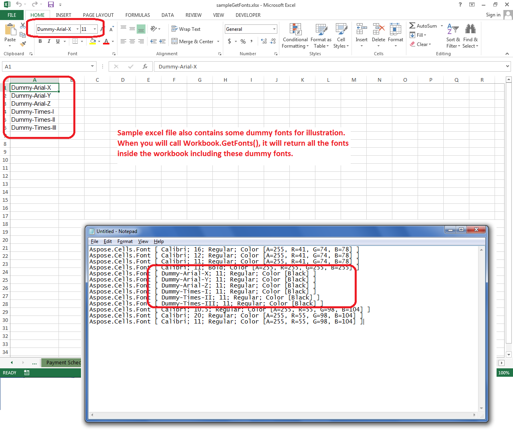

## **Possible Usage Scenarios**

It is often necessary to know the fonts being used in your workbook for rendering purposes. When you convert your workbook into PDF or image, then Aspose.Cells requires that all the needed fonts are installed on your system or present in your **fonts directory**. If Aspose.Cells is unable to find the needed font, it tries to replace it with some other suitable font which is present on your system or in your font directory and can substitute your actual font. This not only results in the undesired rendering of PDF or images but also takes processing time for finding suitable fonts.

In order to deal with such cases, you should know what fonts are being used by your workbook, then either install those fonts on your system in case of Windows environment or place it in your fonts directory in case of windows or Linux environment.

Aspose.Cells provides the [**Workbook.GetFonts**](https://reference.aspose.com/cells/go-cpp/workbook/getfonts/) method which returns the list of all the fonts used in your workbook or spreadsheet.

## **Get a List of Fonts used in a Spreadsheet or Workbook**

The following sample code loads the source excel file and retrieves the list of fonts used inside it. It has one dummy worksheet which has some dummy fonts added for illustration purposes. When the code prints all the fonts inside the workbook, it also prints those dummy fonts. The following screenshot shows the [sample excel file](25395211.xlsx) and how the dummy fonts are listed.

## **Sample Code**


## **Console Output**

Here is the console output of the above sample code when executed with the given [sample excel file](25395211.xlsx).



Aspose.Cells.Font [ Calibri; 11; Regular; Color [Black] ]

Aspose.Cells.Font [ Arial; 10; Regular; Color [A=255, R=0, G=0, B=0] ]

Aspose.Cells.Font [ Calibri; 10; Bold; Color [Black] ]

Aspose.Cells.Font [ Calibri; 10; Regular; Color [A=255, R=128, G=128, B=128] ]

Aspose.Cells.Font [ Calibri; 10; Regular; Color [A=255, R=55, G=98, B=104] ]

Aspose.Cells.Font [ Calibri; 16; Bold; Color [A=255, R=255, G=255, B=255] ]

Aspose.Cells.Font [ Calibri; 36; Regular; Color [A=255, R=55, G=98, B=104] ]

Aspose.Cells.Font [ Calibri; 20; Bold; Color [A=255, R=55, G=98, B=104] ]

Aspose.Cells.Font [ Calibri; 16; Regular; Color [A=255, R=55, G=98, B=104] ]

Aspose.Cells.Font [ Calibri; 11; Regular; Color [A=255, R=55, G=98, B=104] ]

Aspose.Cells.Font [ Calibri; 11; Bold; Color [A=255, R=55, G=98, B=104] ]

Aspose.Cells.Font [ Calibri; 11; Bold; Color [A=255, R=255, G=255, B=255] ]

Aspose.Cells.Font [ Calibri; 11; Italic; Color [A=255, R=55, G=98, B=104] ]

Aspose.Cells.Font [ Calibri; 16; Regular; Color [A=255, R=55, G=98, B=104] ]

Aspose.Cells.Font [ Calibri; 16; Bold; Color [A=255, R=55, G=98, B=104] ]

Aspose.Cells.Font [ Calibri; 16; Regular; Color [Black] ]

Aspose.Cells.Font [ Calibri; 16; Regular; Color [A=255, R=41, G=74, B=78] ]

Aspose.Cells.Font [ Calibri; 16; Regular; Color [A=255, R=41, G=74, B=78] ]

Aspose.Cells.Font [ Calibri; 12; Regular; Color [A=255, R=41, G=74, B=78] ]

Aspose.Cells.Font [ Calibri; 11; Regular; Color [A=255, R=41, G=74, B=78] ]

Aspose.Cells.Font [ Calibri; 11; Bold; Color [A=255, R=255, G=255, B=255] ]

Aspose.Cells.Font [ Dummy-Arial-X; 11; Regular; Color [Black] ]

Aspose.Cells.Font [ Dummy-Arial-Y; 11; Regular; Color [Black] ]

Aspose.Cells.Font [ Dummy-Arial-Z; 11; Regular; Color [Black] ]

Aspose.Cells.Font [ Dummy-Times-I; 11; Regular; Color [Black] ]

Aspose.Cells.Font [ Dummy-Times-II; 11; Regular; Color [Black] ]

Aspose.Cells.Font [ Dummy-Times-III; 11; Regular; Color [Black] ]

Aspose.Cells.Font [ Calibri; 10.5; Regular; Color [A=255, R=55, G=98, B=104] ]

Aspose.Cells.Font [ Calibri; 20; Regular; Color [A=255, R=55, G=98, B=104] ]

Aspose.Cells.Font [ Calibri; 11; Regular; Color [A=255, R=55, G=98, B=104] ]

