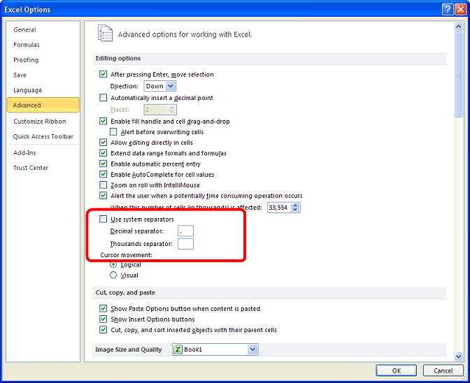

{}

In Microsoft Excel, you can specify custom decimal and thousands separators instead of using the system separators from the **Advanced Excel Options**, as shown in the screenshot below.

Aspose.Cells provides the [**WorkbookSettings.GetNumberDecimalSeparator()**](https://reference.aspose.com/cells/go-cpp/workbooksettings/getnumberdecimalseparator/) and [**WorkbookSettings.GetNumberGroupSeparator()**](https://reference.aspose.com/cells/cpp/aspose.cells/workbooksettings/getnumbergroupseparator/) properties to set the custom separators for formatting/parsing numbers.

{}

## **Specifying Custom Separators using Microsoft Excel**

The following screenshot shows the **Advanced Excel Options** and highlights the section to specify the **Custom Separators**.

## **Specifying Custom Separators using Aspose.Cells**

The following sample code illustrates how to specify the custom separators using the Aspose.Cells API. It sets the custom number decimal and group separators to a dot and a space, respectively.

### C++ code to specify custom number decimal and group separators

