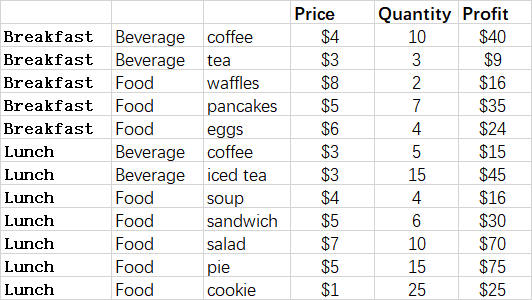

## **Possible Usage Scenarios**
A treemap chart provides a hierarchical view of your data and makes it easy to spot patterns, such as which items are a store's best sellers. The tree branches are represented by rectangles and each sub-branch is shown as a smaller rectangle. The treemap chart displays categories by color and proximity and can easily show lots of data which would be difficult with other chart types.

## **TreeMap chart**
After running the code below, you will see the TreeMap chart as shown below.

## **Sample Code**
The following sample code loads the [sample Excel file](treemap.xlsx) and generates the [output Excel file](out.xlsx).

