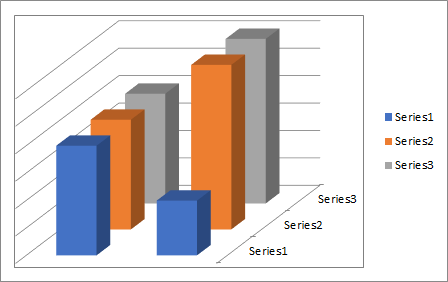

## **Possible Usage Scenarios**
For some 3-D charts such as 3-D column, 3-D cone, or 3-D pyramid which have a depth (series) axis, also known as the Z axis, that you can change, you can specify the interval between tick marks, axis labels, and other operations.

## **Handle Primary and Second Axis like Microsoft Excel**
Please see the following sample code that creates a new Excel file and puts the values of the chart in the first worksheet. Then we add a chart and set the chart type to Column3D; you can see the Z axis, also called the Depth axis.

## **Sample Code**
