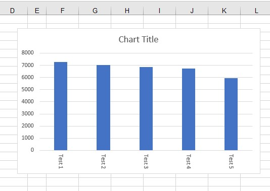

## **Change Tick Label Direction**

Aspose.Cells provides the ability to change the chart tick label direction by using the [**TickLabels.GetDirectionType()**](https://reference.aspose.com/cells/go-cpp/ticklabels/getdirectiontype/) property. The [**TickLabels.GetDirectionType()**](https://reference.aspose.com/cells/go-cpp/ticklabels/getdirectiontype/) property accepts the [**ChartTextDirectionType**](https://reference.aspose.com/cells/cpp/aspose.cells.charts/charttextdirectiontype) enumeration value. The [**ChartTextDirectionType**](https://reference.aspose.com/cells/cpp/aspose.cells.charts/charttextdirectiontype) enumeration provides the following members:

- Horizontal
- Vertical
- Rotate90
- Rotate270
- Stacked

The following image compares the source and output files:

### **Source file image**

### **Output file image**

The following code snippet changes the tick label direction from Rotate90 to Horizontal.

## **Sample Code**



The source and output files can be downloaded from the following links.

[Source File](105480221.xlsx)

[Output File](105480223.xlsx)