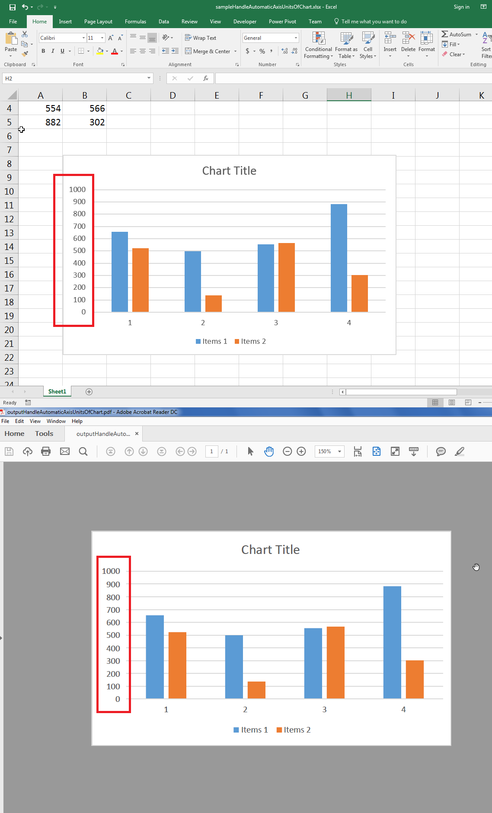

## **Possible Usage Scenarios**
Early versions of Aspose.Cells were not able to handle automatic units of the chart axis properly when the chart is rendered to an image or PDF. Now, Aspose.Cells supports handling automatic units on the chart axis. There is no code change. Just convert your chart into an image or PDF and it will render the chart axis just like Microsoft Excel renders it.

## **Handle Automatic Units of Chart Axis like Microsoft Excel**
The following sample code loads the [sample Excel file](61767755.xlsx) and generates the [output PDF chart](61767752.pdf). The screenshot shows the automatic units of the chart axis in red rectangles and also compares the sample Excel file chart with the output PDF chart. Both are exactly the same.

## **Sample Code**
