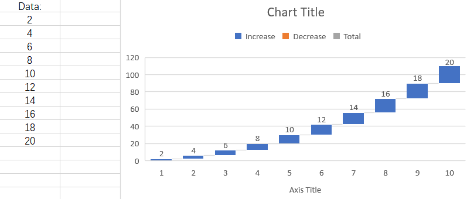

## **Possible Usage Scenarios**

Aspose.Cells APIs have exposed the [**ChartGlobalizationSettings**](https://reference.aspose.com/cells/go-cpp/chartglobalizationsettings/) class in order to deal with the scenarios where the user wishes to set chart component to different language. custom labels for Subtotals in a spreadsheet. 

## **Introduction to ChartGlobalizationSettings Class**

The [**ChartGlobalizationSettings**](https://reference.aspose.com/cells/go-cpp/chartglobalizationsettings/) class currently offers the following 8 methods which can be overridden in a custom class to translate such as AxisTitle name, AxisUnit name, ChartTitle name and so on to different language.

1. [**GetAxisTitleName**](https://reference.aspose.com/cells/go-cpp/chartglobalizationsettings/getaxistitlename/): Gets the name of Title for Axis.
1. [**GetAxisUnitName**](https://reference.aspose.com/cells/go-cpp/chartglobalizationsettings/getaxisunitname/): Gets the Name of Axis Unit.
1. [**GetChartTitleName**](https://reference.aspose.com/cells/go-cpp/chartglobalizationsettings/getcharttitlename/): Gets the name of Chart Title.
1. [**GetLegendDecreaseName**](https://reference.aspose.com/cells/go-cpp/chartglobalizationsettings/getlegenddecreasename/): Gets the name of Decrease for Legend.
1. [**GetLegendIncreaseName**](https://reference.aspose.com/cells/go-cpp/chartglobalizationsettings/getlegendincreasename/): Gets the name of increase for Legend.
1. [**GetLegendTotalName**](https://reference.aspose.com/cells/go-cpp/chartglobalizationsettings/getlegendtotalname/): Gets the name of Total for Legend.
1. [**GetOtherName**](https://reference.aspose.com/cells/go-cpp/chartglobalizationsettings/getothername/): Gets the name of "Other" labels for Chart.
1. [**GetSeriesName**](https://reference.aspose.com/cells/go-cpp/chartglobalizationsettings/getseriesname/): Gets the name of Series in the Chart.

### **Custom language translation**
Here, we will create a waterfall chart based on the following data. The names of chart components will be displayed in English in the chart. We will use a Turkish language example to show how to display the Chart Title, Legend Increase/Decrease names, Total name, and Axis Title in Turkish.

## **Sample Code**
The following sample code loads the [sample Excel file](waterfall.xlsx).


## Output generated by the sample code

This is the console output of the above sample code.



Workbook chart title: Grafik Başlığı

Workbook chart legend: Artış

Workbook chart legend: Düşüş

Workbook chart legend: Toplam

Workbook category axis tile: Eksen Başlığı

