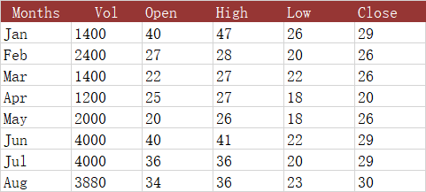

{}

This paragraph will tell you how to create stock charts, which include four types:
- **HLC** – High-Low-Close.
- **OHLC** – Open-High-Low-Close.
- **VHLC** – Volume-High-Low-Close.
- **VOHLC** – Volume-Open-High-Low-Close.

{}

## **What is a stock chart?**

Stock charts are a specific type of chart used to track changes in the price of traded assets, such as commodities, stocks, and cryptocurrencies. They allow you to see high and low values over time, along with opening and closing values in one chart. Aspose.Cells offers four stock charts, and to use them you must have the appropriate data sets available and select the columns in the right order.

The following dataset shows the daily trading information for a stock. We will use this data to create four types of stock charts: High-Low-Close (HLC) stock chart, Open-High-Low-Close (OHLC) chart, Volume-High-Low-Close (VHLC) stock chart, and Volume-Open-High-Low-Close (VOHLC) stock chart.

