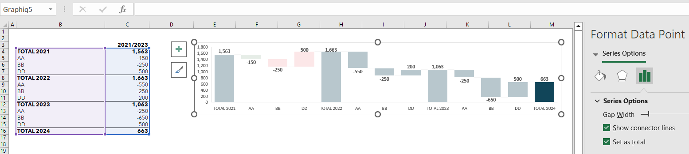

---  
title: How to set point as total with Golang via C++  
linktitle: How to set point as total  
description: In some Excel charts, for example, a waterfall chart, you may need to set a point as total. This article describes how to use Aspose.Cells with Golang via C++ to do it.  
keywords: Waterfall Chart, Point, Set as total.  
type: docs  
weight: 72  
url: /go-cpp/how-to-set-point-as-total/  
---  

## What is "Set point as total" in Excel Chart  

In some Excel charts, for example, a waterfall chart, some point data are the sum of the previous points; you may need to set a point as total. We will show sample code and an illustration below.  

## A waterfall Chart needs to "Set point as total"  

  

This picture shows a waterfall chart in Excel. We can see that there are four data points starting with **Total**, and they are used to sum all the previous data points.  

In this picture, the settings are not exactly right; when we select the point **Total 2024**, we can see that the **Set as total** option is not checked in Excel.  

Attached below is the [sample Excel file](SampleSheet.xlsx) that needs to be modified, and we will use Aspose.Cells to set it up correctly.  

## Use Aspose.Cells to "Set point as total"  

We use the following code to get the file set up correctly:  

  

You can download the following correct [output file](output.xlsx).  

As shown in the figure below, the four **Total** data points are set correctly, and you can see the difference from the previous chart.  

