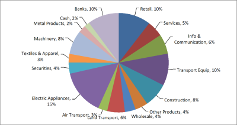

{}

This article explains how to create a pie chart with leader lines from scratch while using Aspose.Cells for Go via Go API. In Excel, the 'Show leader lines' option is set by default, so when you create a pie chart in Excel the leader lines are shown. However, while creating a similar chart with Aspose.Cells APIs, you have to explicitly set the [**Series.GetHasLeaderLines()**](https://reference.aspose.com/cells/go-cpp/series/gethasleaderlines/) property.

{}

To demonstrate the usage of Aspose.Cells for Go via Go API to create a pie chart with leader lines, we will first create a new [**Workbook**](https://reference.aspose.com/cells/go-cpp/workbook/) and input some data that will serve as the series data source. Once the data is in place, we will add a [**Chart**](https://reference.aspose.com/cells/go-cpp/chart/) of type [**ChartType.Pie**](https://reference.aspose.com/cells/go-cpp/charttype/) to the collection of charts and set its different aspects to get the desired chart view.



So far we have created a pie chart and set its different aspects. Now we are going to turn on the leader lines for the chart. Please note that to show the leader lines, we have to move the data labels a little.

The following piece of code turns on the leader lines, refreshes the chart, and then calculates the data labels' positions to move them accordingly.



Finally, the following code saves the chart in image format and the workbook in XLSX format.



|**Resultant Pie Chart**|
| :- |
||

## **Advanced topics**
- [Custom Slice or Sector Colors in Pie Chart](/cells/go-cpp/custom-slice-or-sector-colors-in-pie-chart/)
- [Find if Data Points are in the Second Pie or Bar on a Pie of Pie or Bar of Pie Chart](/cells/go-cpp/find-if-data-points-are-in-the-second-pie-or-bar-on-a-pie-of-pie-or-bar-of-pie-chart/)

## Related Articles

- [Creating Charts](/cells/go-cpp/creating-charts/)
- [Customizing Charts](/cells/go-cpp/customizing-charts/)
- [Data Formatting in Charts](/cells/go-cpp/data-formatting-in-charts/)
- [Setting Chart Appearance](/cells/go-cpp/setting-chart-appearance/)

