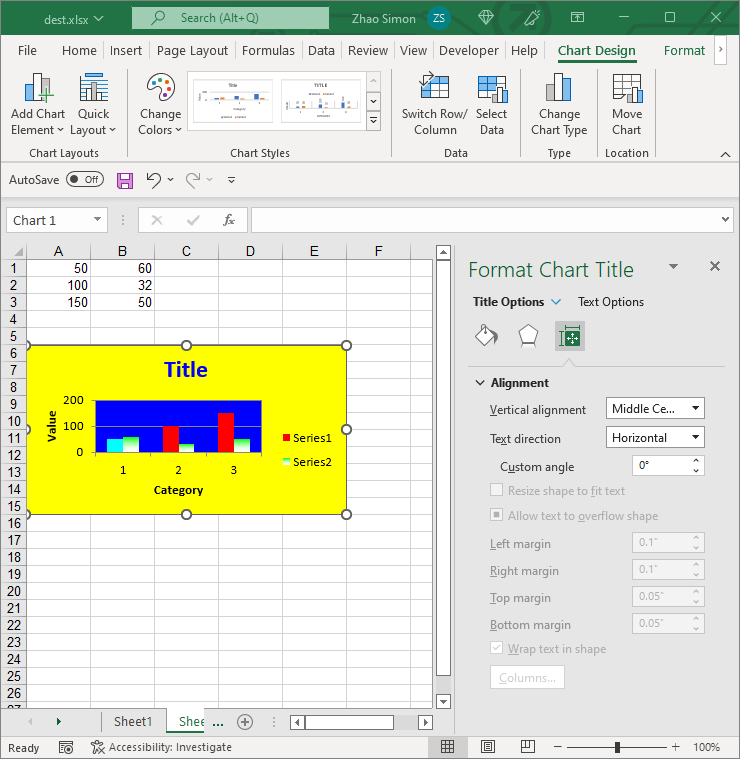

{}

In Excel charts, there are two kinds of titles:
1. Chart Title  
2. Axis Titles

{}

## **Title Options**
Aspose.Cells also allows you to manage chart titles at runtime. With the [Title](https://reference.aspose.com/cells/go-cpp/title/) object, you can change text, font, and fill format for titles.

||

## **Setting the Titles of Charts or Axes**
You can use Microsoft Excel to set the titles of a chart and its axes in a WYSIWYG environment. Aspose.Cells also allows developers to set the titles of a chart and its axes at runtime. All charts and their axes contain a [Title](https://reference.aspose.com/cells/go-cpp/title/) property that can be used to set their titles, as shown in the example below.

The following code snippet demonstrates how to set titles for charts and axes.



## **Advanced Topics**
- [Read Chart Subtitle from ODS File](/cells/cpp/read-chart-subtitle-from-ods-file/)