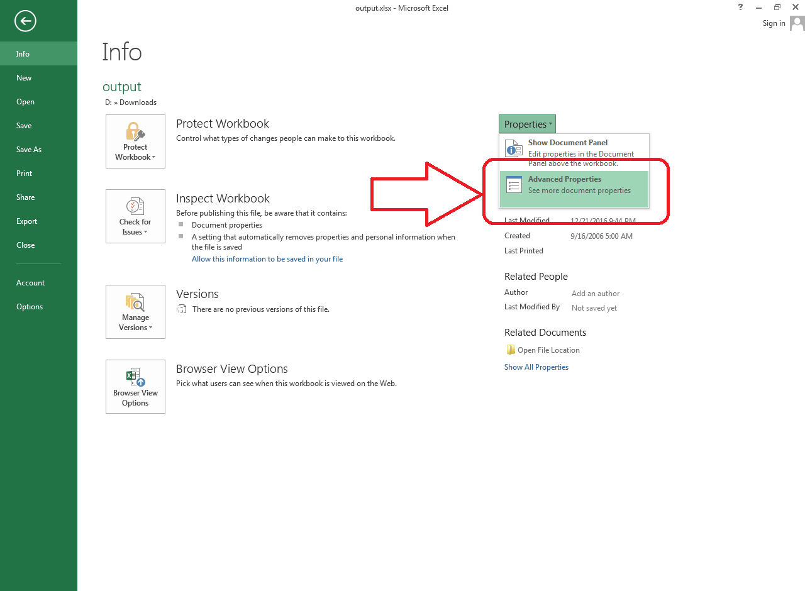

## **Possible Usage Scenario**

Aspose.Cells allows you to work with built‑in and custom document properties. Here is the Microsoft Excel interface for opening these document properties. Just click on **Advanced Properties**, as shown in the screenshot, to view them.

## **Managing Document Properties**

The following sample code loads the [sample Excel file](23166989.xlsx), reads the built‑in document properties (e.g., Title and Subject), and then changes them. It also reads the custom document property (i.e., *MyCustom1*) and adds a new custom document property (i.e., *MyCustom5*) before writing the [output Excel file](23166986.xlsx). The screenshot below shows the effect of the sample code on the sample Excel file.

## **Sample Code**



## **Console Output**

This is the console output of the above sample code when executed with the provided [sample Excel file](23166989.xlsx).



Title: Aspose Team

Subject: Aspose.Cells for Go via C++

MyCustom1: This is my custom one.

