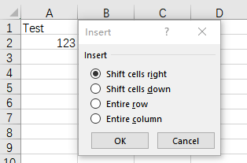

---  
title: Insert Ranges to Excel with Golang via C++  
linktitle: Insert Ranges  
type: docs  
weight: 105  
url: /go-cpp/insert-ranges-to-excel/  
description: Learn how to insert ranges into Excel files using Aspose.Cells with Golang via C++.  
---  

## **Introduction**

In Excel, you can select a range, then insert a range and shift other data right or down.

****

## **Insert Ranges Using Aspose.Cells**

Aspose.Cells provides [Cells.InsertRange](https://reference.aspose.com/cells/go-cpp/cells/insertrange_cellarea_int_shifttype_bool/) method to insert a range.

## **Insert Ranges And Shift Cells Right**

Insert a range and shift cells right as the following codes with Aspose.Cells:


## **Insert Ranges And Shift Cells Down**

Insert a range and shift cells down as the following codes with Aspose.Cells:


