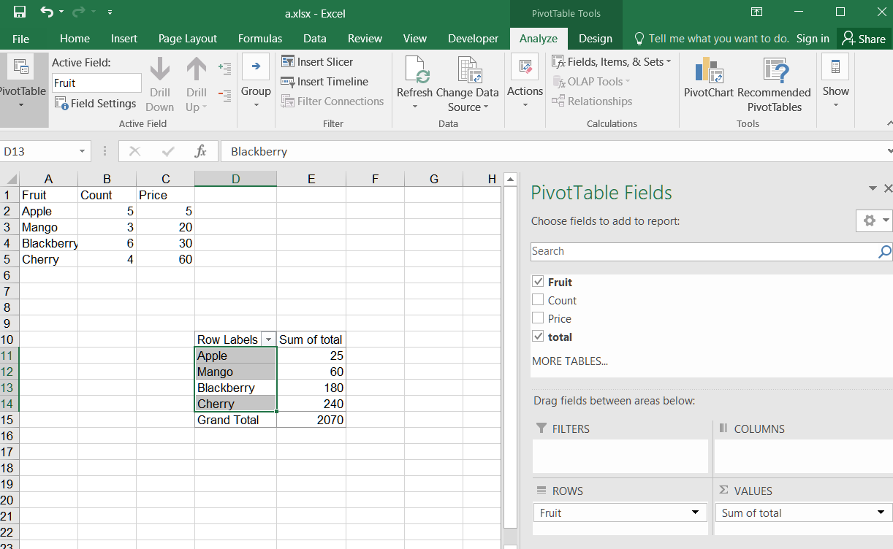

## **Possible Usage Scenarios**
When you create a pivot table based on known data, you may find that the data in it is not what you want. The data you need is a combination of the original data. For example, you may need to add, subtract, multiply, or divide the original data before obtaining the desired results. In such cases, you need to create a calculated field and set the corresponding formula for the calculation, then perform some statistical and other operations on the calculated field. 

## **Add calculated field in Pivot Table in Excel**
Insert a calculated field in a PivotTable in Excel, follow these steps:

1. Select the PivotTable that you want to add a calculated field to. 
2. Go to the PivotTable Analyze tab on the ribbon.
3. Click on "Fields, Items, & Sets" and then select "Calculated Field" from the drop-down menu.
4. In the "Name" field, enter a name for the calculated field.
5. In the "Formula" field, enter the formula for the calculation you want to perform using the appropriate PivotTable field names and mathematical operators. 
 

6. Click **OK** to create the calculated field.
7. The new calculated field will appear in the PivotTable Field List under the Values section.
8. Drag the calculated field to the Values section of the PivotTable to display the calculated values.
 

## **Add calculated field in Pivot Table Using C++**
Add a calculated field to an Excel file using Aspose.Cells. Please see the following sample code. After executing the example code, a pivot table with a calculated field is added to the worksheet.
1. Set the original data and create a pivot table. 
2. Create the calculated field according to the existing PivotField in the pivot table.
3. Add the calculated field to the data area. 
4. Finally, it saves the workbook in the [output XLSX](out.xlsx) format. 

## **Sample Code**
