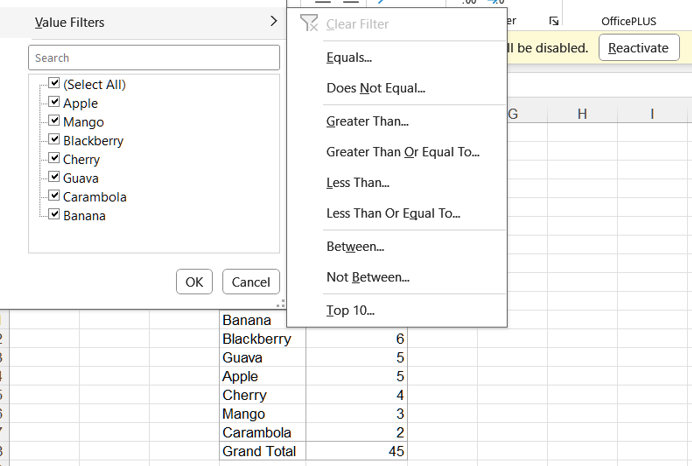
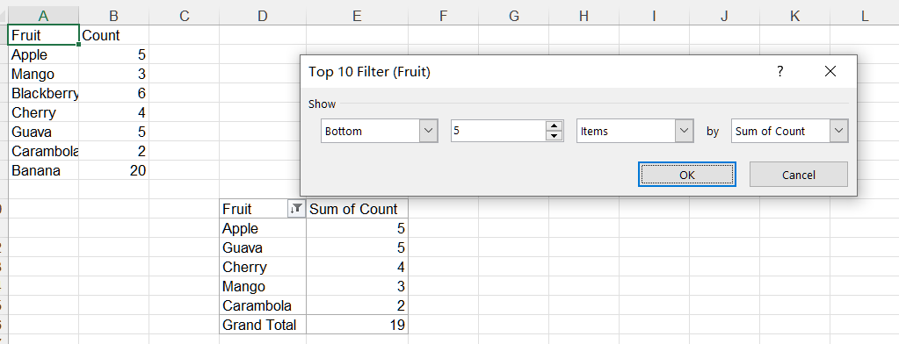
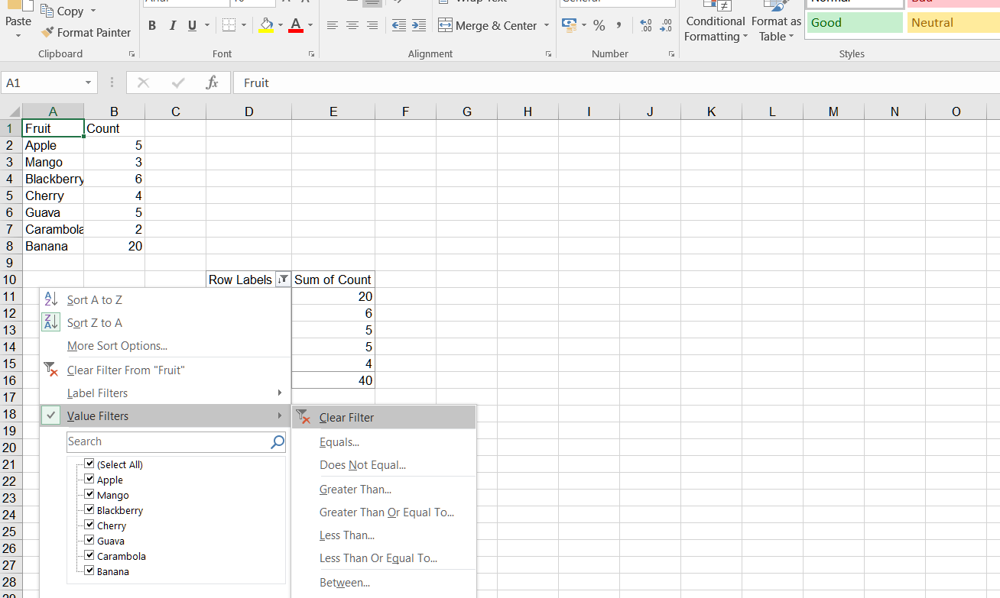
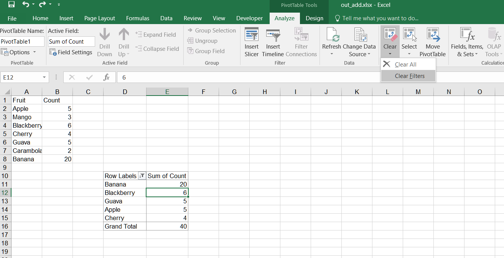

## **Possible Usage Scenarios**
When you create a pivot table with known data and want to filter the pivot table, you need to learn and use a filter. It can help you filter out the data you want effectively. By using the Aspose.Cells API, you can add and clear filters on field values in Pivot Tables. 

## **Add Filter in Pivot Table in Excel**
Add a filter in a Pivot Table in Excel, follow these steps:

1. Select the PivotTable that you want to add a filter to.  
2. Click on the drop‑down arrow for the filter you want to add in the pivot table.  
3. Select **Top 10** from the drop‑down menu.  
    
   
4. Set the show mode and the number of items.  
    
   

## **Add Filter in Pivot Table**
Please see the following sample code. It sets the data and creates a PivotTable based on it. Then it adds a filter on the row field of the pivot table. Finally, it saves the workbook in the [output XLSX](filterout.xlsx) format. After executing the example code, a pivot table with a Top 10 filter is added to the worksheet.

### **Sample Code**


## **Clear Filter in Pivot Table in Excel**
Clear a filter in a Pivot Table in Excel, follow these steps:

1. Select the PivotTable that you want to clear the filter from.  
2. Click on the drop‑down arrow for the filter you want to clear in the pivot table.  
3. Select **Clear Filter** from the drop‑down menu.  
    
   
4. If you want to clear all filters from the pivot table, you can also click the **Clear Filters** button on the **PivotTable Analyze** tab of the ribbon in Excel.  
    
   

## **Clear Filter in Pivot Table**
Clear a filter in a Pivot Table using Aspose.Cells. Please see the following sample code.  

1. Set the data and create a PivotTable based on it.  
2. Add a filter on the row field of the pivot table.  
3. Save the workbook in the [output XLSX](out_add.xlsx) format. After executing the example code, a pivot table with a Top 10 filter is added to the worksheet.  
4. Clear the filter on a specific PivotField. After executing the code to clear the filter, the filter on the specific PivotField will be removed. Please check the [output XLSX](out_delete.xlsx).

### **Sample Code**



