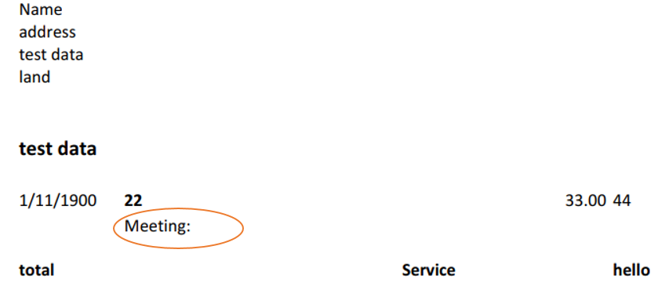

## **Possible Usage Scenarios**
The height of a row automatically matches the font of its content, but when the height of the cached row does not match the height of the content in the file, MS Excel will automatically adjust the row height when loading the file, whereas Aspose.Cells will not automatically adjust it in order to improve performance. If you need Aspose.Cells to automatically match row heights when loading files, you can achieve this by using the parameter [LoadOptions.GetOnlyAuto()](https://reference.aspose.com/cells/cpp/aspose.cells/autofitteroptions/getonlyauto/).

Please refer to the following image. We can observe that the cached row height in row 11 is 15, but Excel automatically adjusts the row height when loading the file.  
 

## **Adjust Row Height using Aspose.Cells**
If you load the file directly and save it to PDF, the data will not be fully displayed in the PDF because the cached row height is only 15.  
 

 
If you set the parameter [LoadOptions.GetOnlyAuto()](https://reference.aspose.com/cells/cpp/aspose.cells/autofitteroptions/getonlyauto/) to **true** when loading the file, Aspose.Cells will automatically adjust the row height. The adjusted row height can effectively meet the text‑display requirements.  
 

## **Go Sample Code**

