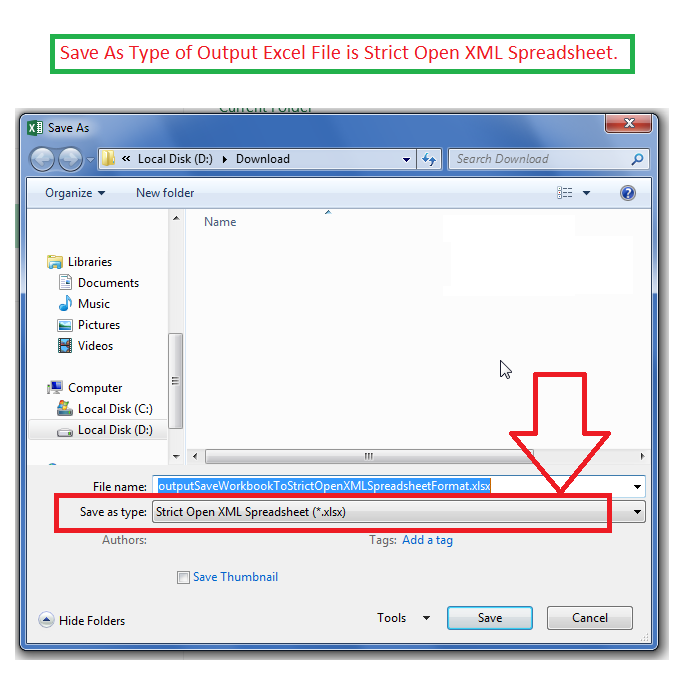

## **Possible Usage Scenarios**

Aspose.Cells allows you to save the workbook in *Strict Open XML Spreadsheet* format. For that purpose, it provides the [**GetCompliance()**](https://reference.aspose.com/cells/go-cpp/workbooksettings/getcompliance/) property. If you set its value as [**OoxmlCompliance::Iso29500_2008_Strict**](https://reference.aspose.com/cells/cpp/aspose.cells/ooxmlcompliance/), then the output Excel file will be saved in Strict Open XML Spreadsheet format.

## **Save Workbook to Strict Open XML Spreadsheet Format**

The following sample code creates a workbook and sets the value of the [**GetCompliance()**](https://reference.aspose.com/cells/go-cpp/workbooksettings/getcompliance/) property as [**OoxmlCompliance::Iso29500_2008_Strict**](https://reference.aspose.com/cells/cpp/aspose.cells/ooxmlcompliance/) and saves it as [output Excel file](67338272.xlsx). If you open the output Excel file in Microsoft Excel and open the Save As... dialog box, you will see its format as *Strict Open XML Spreadsheet* as shown in this screenshot.

## **Sample Code**

