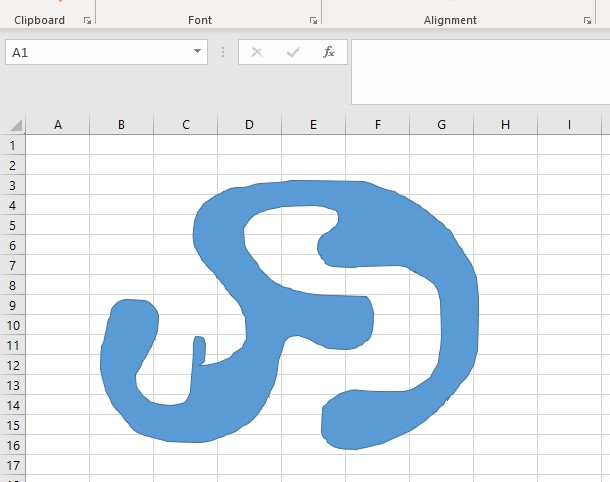

## **Accessing Data of Non-Primitive Shape**

Sometimes, you need to access data from a shape that is not built-in. Built-in shapes are called primitive shapes; ones that aren't are called non-primitive. For example, you can define your own shapes using different curve connected lines.

## **A Non-Primitive Shape**

In Aspose.Cells, non-primitive shapes are assigned the type [**AutoShapeType.NotPrimitive**](https://reference.aspose.com/cells/go-cpp/autoshapetype/). You can check their type using the [**Shape.AutoShapeType**](https://reference.aspose.com/cells/go-cpp/autoshapetype/) property.

Access the shape data using the [**Shape.GetPaths()**](https://reference.aspose.com/cells/go-cpp/shape/getpaths/) property. It returns all the connected paths that comprise the non-primitive shape. These paths are of the type [**ShapePath**](https://reference.aspose.com/cells/cpp/aspose.cells.drawing/shapepath/) that holds a list of all the segments which in turn contain the points in each segment.

|**Shows an example of a non-primitive shape**|
| :- |
||

