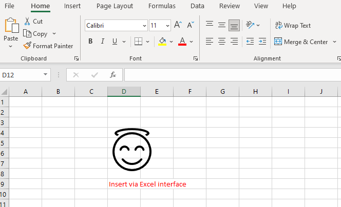
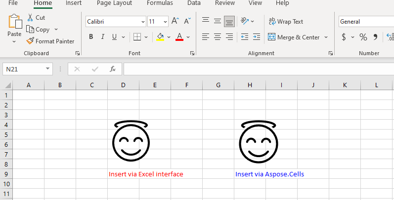

## Add Icons to Worksheet in Aspose.Cells

If you need to use [Aspose.Cells](https://products.aspose.com/cells/) to add icons to an Excel file, this document can provide you with some help.

The Excel interface corresponding to the insert‑icon operation is as follows:

- Select the position of the icon to be inserted in the worksheet
- Left‑click *Insert* → *Icons*
- In the window that opens, select the icon in the red rectangle in the figure above
- Left‑click *Insert*; it will be inserted into the Excel file.

The effect is as follows:

Here, we have prepared *sample code* to help you insert icons using [Aspose.Cells](https://products.aspose.com/cells/). There is also a required [sample file](sample.xlsx) and an icon [resource file](icon.zip). We used the Excel interface to insert an icon with the same display effect as the resource file in the sample file.

### C++


When you run the above code in your project, you will get the following result:

