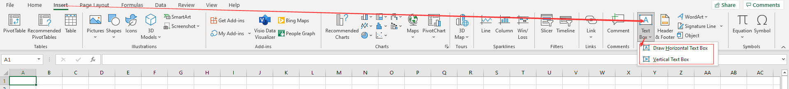

## Add Text Box to Worksheet in Excel

In Excel (version 2007 and above), there are two places where you can insert text boxes: one in **Insert Shapes**, and the other on the right side of the top menu of the **Insert** option.

### Method One:

### Method Two:

## How to Create

You can create text boxes with horizontal or vertical text.

- Select the corresponding option (horizontal or vertical)
- Left‑click on the page
- Hold down the left mouse button and drag a distance on the page
- Release the left mouse button

Now you have a text box.

## Add Text Box to Worksheet in Aspose.Cells

When you need to bulk insert a TextBox into a worksheet, the manual insertion method is obviously impractical. If this bothers you, this document will help. [Aspose.Cells](https://products.aspose.com/cells/) provides an API to easily perform bulk inserts in your code.

The following sample code creates a text box.



You will get a file similar to the [result file](result.xlsx). In the file, you will see the following:

