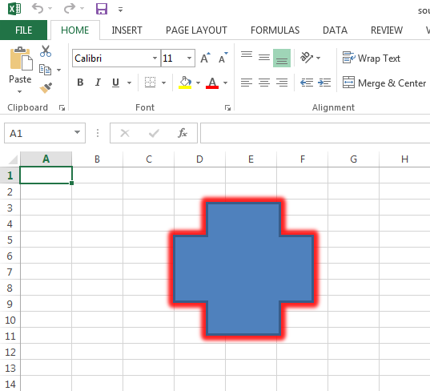

## Possible Usage Scenarios

If you want to read the color of the glow effect of any shape, then please use the [**Shape.Glow.Color**](https://reference.aspose.com/cells/go-cpp/color/) property. It will help you find the various properties relating to the color of the glow effect of the shape.

## Read Color of the Glow Effect of Shape

Please see the following sample code and its [source Excel file](22774108.xlsx) and the console output for your reference. The following screenshot shows the glow effect of the shape inside the source Excel file when viewed in Microsoft Excel.

## C++ code to read the color of a shape's glow effect



## Console Output

Here is the console output of the above sample code when executed with the provided [source Excel file](22774108.xlsx).


Color: Color [A=222, R=255, G=0, B=0]

ColorIndex: 16711672

IsShapeColor: True

Transparency: 0.13

Type: RGB
