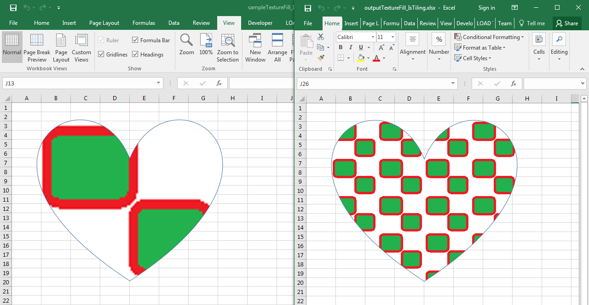

## **Possible Usage Scenarios**

When the picture is small and cannot cover the entire surface of the shape without losing quality, you have the option to tile it. Tiling fills the shape surface with a small image by repeating it as if it were a tile.

## **Tile Picture as a Texture inside the Shape**

You can fill the shape surface with some image and tile it using the [**Shape.Fill.TextureFill.IsTiling**](https://reference.aspose.com/cells/go-cpp/texturefill/istiling/) property by setting it **true**. Please see the following sample code, its [sample Excel file](46465050.xlsx) as well as the screenshot for reference.

## **Screenshot**

## **Sample Code**

