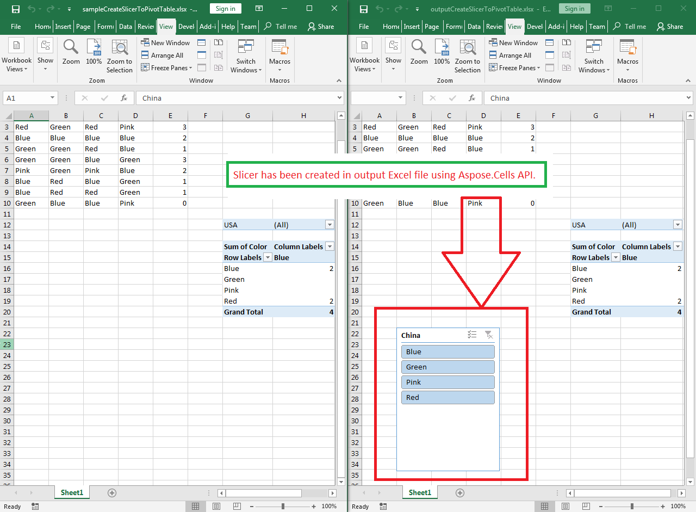

## **Possible Usage Scenarios**

A slicer is used to filter data quickly. It can be used to filter data in either a table or a pivot table. Microsoft Excel allows you to create a slicer by selecting a table or pivot table and then clicking *Insert > Slicer*. Aspose.Cells also allows you to create a slicer using the [**Worksheet.Slicers.Add()**](https://reference.aspose.com/cells/go-cpp/slicercollection/add_pivottable_string_string/) method.

## **Create a Slicer for a Pivot Table**

Please see the following sample code. It loads the [sample Excel file](67338470.xlsx) that contains the pivot table. It then creates the slicer based on the first base pivot field. Finally, it saves the workbook in [output XLSX](67338471.xlsx) and [output XLSB](67338472.xlsb) formats. The following screenshot shows the slicer created by Aspose.Cells in the output Excel file.

### **Sample Code**



## **Create a Slicer for an Excel Table**

Please see the following sample code. It loads the [sample Excel file](sampleCreateSlicerToExcelTable.xlsx) that contains a table. It then creates the slicer based on the first column. Finally, it saves the workbook in [output XLSX](outputCreateSlicerToExcelTable.xlsx) format.

### **Sample Code**



## **Advanced Topics**
- [Change Slicer Properties](/cells/go-cpp/change-slicer-properties/)
- [Draw Slicer while rendering Excel to PDF](/cells/go-cpp/draw-slicer-while-rendering-excel-to-pdf/)
- [Formatting Slicer](/cells/go-cpp/formatting-slicer/)
- [Removing Slicer](/cells/go-cpp/removing-slicer/)
- [Rendering Slicer](/cells/go-cpp/rendering-slicer/)
- [Updating Slicer](/cells/go-cpp/updating-slicer/)

