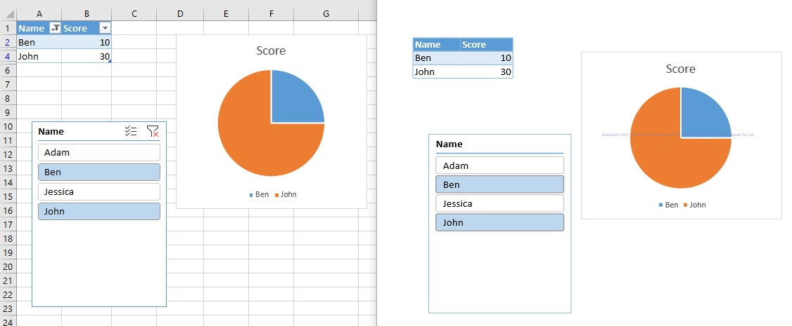

## **Draw Slicer while rendering Excel to PDF**
If you have an Excel file which has a slicer applied to it and you want to export the Excel to PDF with the slicer settings, Aspose.Cells now supports this by default. You simply export the Excel file with a slicer to PDF, and the generated PDF will show the slicer applied.

The following sample code loads the [sample Excel file](94044165.xlsx) that contains an existing slicer. It then saves the workbook as [output PDF file](94044166.pdf). The following screenshot compares the source Excel file and the generated PDF file.

## **Sample Code**
