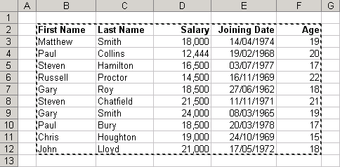
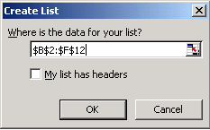
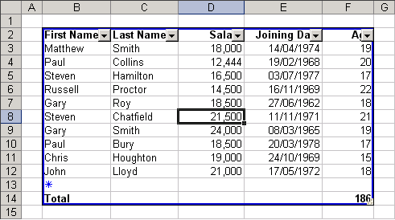

## **Create Table**

One of the advantages of spreadsheets is that they allow you to create different types of lists, for example, phone lists, task lists, lists of transactions, assets or liabilities. Several users can work together to use, create and maintain various lists.

Aspose.Cells supports creating and managing lists.

### **Advantages of a List Object**

There are quite a few advantages when you convert a list of data to an actual List Object.

- New rows and columns are automatically included.
- A total row at the bottom of your list can be easily added to display SUM, AVERAGE, COUNT, etc.
- Columns added to the right are automatically incorporated into the List object.
- Charts based on rows and columns will be expanded automatically.
- Named ranges assigned to rows and columns will be expanded automatically.
- The list is protected from accidental row and column deletion.

### **Creating a List Object using Microsoft Excel**

|**Selecting data range for creating List object**|
| :- |
||
This displays the Create List dialog.

|**Create List dialog**|
| :- |
||
Implement the List object for the data and specify the total row (Select **Data**, then **List**, followed by **Total Row**).

|**Creating a list object**|
| :- |
||

### **Using Aspose.Cells API**

Aspose.Cells provides a class [Workbook](https://reference.aspose.com/cells/go-cpp/workbook/) that represents a Microsoft Excel file. The [Workbook](https://reference.aspose.com/cells/go-cpp/workbook/) class contains a [Worksheets](https://reference.aspose.com/cells/go-cpp/worksheetcollection/) collection that allows access to each worksheet in an Excel file.

A worksheet is represented by the [Worksheet](https://reference.aspose.com/cells/go-cpp/worksheet/) class. The [Worksheet](https://reference.aspose.com/cells/go-cpp/worksheet/) class provides a wide range of methods for managing a worksheet. To create a [ListObject](https://reference.aspose.com/cells/go-cpp/listobject/) in a worksheet, use the [GetListObjects](https://reference.aspose.com/cells/go-cpp/worksheet/getlistobjects/) collection method of the [Worksheet](https://reference.aspose.com/cells/go-cpp/worksheet/) class. Each `[ListObject]` is, in fact, an object of the [ListObjectCollection](https://reference.aspose.com/cells/go-cpp/listobjectcollection/) class, which further provides the [Add](https://reference.aspose.com/cells/go-cpp/listobjectcollection/add_int_int_int_int_bool/) method for adding a `[ListObject]` object and specifying a range of cells for the list.

Based on the specified range of cells, the `[ListObject]` object is created by Aspose.Cells. Use attributes (for example, [SetShowTotals](https://reference.aspose.com/cells/go-cpp/listobject/setshowtotals/) and [GetListColumns](https://reference.aspose.com/cells/go-cpp/listobject/getlistcolumns/), etc.) of the `[ListObject]` class to control the list.

In the example given below, we have created the same `[ListObject]` using the Aspose.Cells API as we created using Microsoft Excel in the above section.



## **Format a Table**

To manage and analyze a group of related data, it is possible to turn a range of cells into a list object (also known as an Excel table). A table is a series of rows and columns that contain related data managed independently from the data in other rows and columns. By default, every column in the table has filtering enabled in the header row so that you can filter or sort your list object data quickly. You can add a total row (a special row in a list that provides a selection of aggregate functions useful for working with numerical data) to the list object; this provides a drop‑down list of aggregate functions for each total‑row cell. Aspose.Cells provides options for creating and managing lists (or tables).

### **Formatting a List Object**

Aspose.Cells provides a class [Workbook](https://reference.aspose.com/cells/go-cpp/workbook/) that represents a Microsoft Excel file. The [Workbook](https://reference.aspose.com/cells/go-cpp/workbook/) class contains a [Worksheets](https://reference.aspose.com/cells/go-cpp/worksheetcollection/) collection that allows access to each worksheet in an Excel file.

A worksheet is represented by the [Worksheet](https://reference.aspose.com/cells/go-cpp/worksheet/) class. The [Worksheet](https://reference.aspose.com/cells/go-cpp/worksheet/) class provides a wide range of methods for managing a worksheet. To create a *ListObject* in a worksheet, use the `ListObjectCollection` class. Each `[ListObject]` is, in fact, an object of the `ListObjectCollection` class, which further provides the [Add](https://reference.aspose.com/cells/go-cpp/listobjectcollection/add/) method for adding a `[ListObject]` object and specifying the range of cells it should encompass. Based on the specified range of cells, a *ListObject* is created in the worksheet by Aspose.Cells. Use attributes (for example, [SetTableStyleType](https://reference.aspose.com/cells/go-cpp/listobject/settablestyletype/)) of the `[ListObject]` class to format the table for your requirements.

The example below adds sample data to a worksheet, adds a `[ListObject]`, and applies default styles to it. `[ListObject]` styles are supported by Microsoft Excel 2007/2010.

