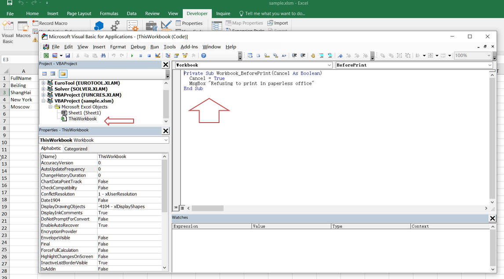
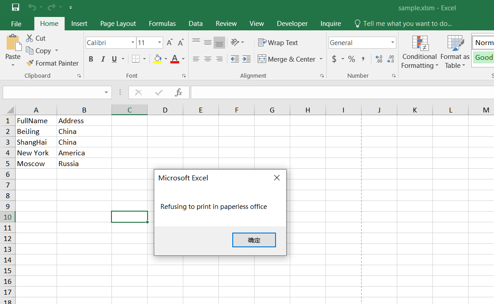

---  
title: How to Prevent Users from Printing Excel File with Golang via C++  
linktitle: How to Prevent Users from Printing Excel File  
type: docs  
weight: 600  
url: /go-cpp/how-to-prevent-printing-excel/  
description: Learn how to prevent users from printing Excel through the Aspose.Cells for C++ API.  
keywords: excel printing, prevent printing excel, how to prevent users from printing excel, excel prevent printing, prevent printing workbook, Prevent users from printing the whole workbook with VBA.  
---  

## **Possible Usage Scenarios**  
In our daily work, there may be some important information in an Excel file; in order to protect internal data from being spread, the company may prohibit printing it. This document explains how to prevent others from printing Excel files.  

## **How to Prevent Users from Printing File in MS-Excel**  
You can apply the following VBA code to protect your specific file from being printed.  
1. Open the workbook that you do not allow others to print.  
1. Select the **Developer** tab in the Excel ribbon and click on the **View Code** button in the **Controls** section. Alternatively, you can hold down the **ALT + F11** keys to open the Microsoft Visual Basic for Applications window.  
   
  
1. Then, in the left Project Explorer, double‑click on **ThisWorkbook** to open the module and add some VBA code.  
   
  
1. Then save and close the code, return to the workbook, and when you attempt to print the sample file, printing will be blocked and you will see the following warning box:  
   
  

## **How to Prevent Users from Printing Excel File using Aspose.Cells for C++**  

The following sample code illustrates how to prevent users from printing an Excel file:  

1. Load the [sample file](sample.xlsx).  
1. Get the **VbaModuleCollection** object from the **VbaProject** property of the **Workbook**.  
1. Get the **VbaModule** object via the “ThisWorkbook” name.  
1. Set the **Code** property of the **VbaModule**.  
1. Save the sample file to [xlsm format](out.xlsm).  

