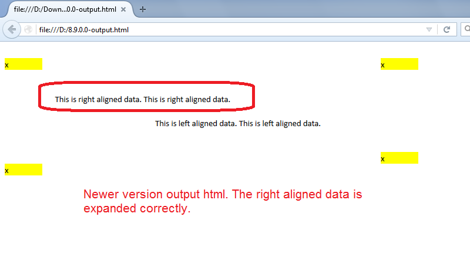

{} 

Aspose.Cells for C++ now supports expanding text from right to left while exporting Excel files to HTML. This feature has been implemented since v8.9.0.0. If your source Excel file contains any text that expands from right to left, Aspose.Cells will export it to HTML correctly.

{} 

## **Expanding text from right to left while exporting Excel files to HTML**

The following sample code converts the [sample Excel file](5115502.xlsx) into HTML. This screenshot shows how the sample Excel file looks in Microsoft Excel 2013.

This screenshot shows the [output HTML generated with the older version](5115509).

This screenshot shows the [output HTML generated with the newer version](5115508).

As you can see in the screenshots, the newer version expands the right‑aligned text to the left correctly, just like Microsoft Excel.

