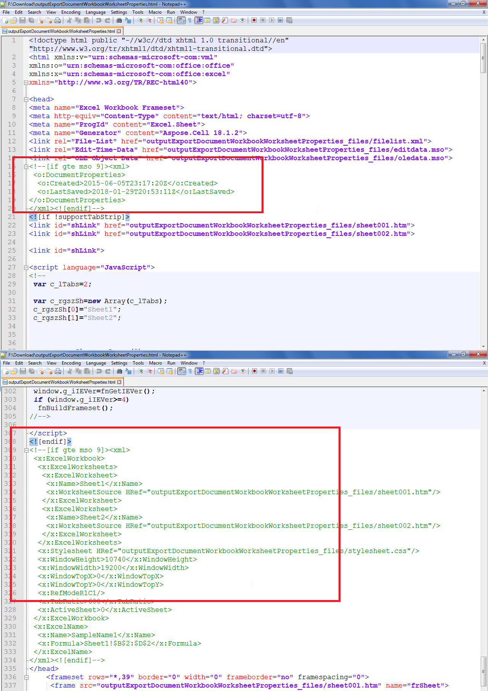

## **Possible Usage Scenarios**

When a Microsoft Excel file is exported to HTML using Microsoft Excel or Aspose.Cells, it also exports various types of Document, Workbook, and Worksheet properties as shown in the following screenshot. You can avoid exporting these properties by setting the [**HtmlSaveOptions.GetExportDocumentProperties()**](https://reference.aspose.com/cells/go-cpp/htmlsaveoptions/getexportdocumentproperties/), [**HtmlSaveOptions.GetExportWorkbookProperties()**](https://reference.aspose.com/cells/cpp/aspose.cells/htmlsaveoptions/getexportworkbookproperties/), and [**HtmlSaveOptions.GetExportWorksheetProperties()**](https://reference.aspose.com/cells/cpp/aspose.cells/htmlsaveoptions/getexportworksheetproperties/) to **false**. The default value of these properties is **true**. The following screenshot shows how these properties appear in the exported HTML.

## **Export Document, Workbook, and Worksheet Properties in Excel to HTML Conversion**

The following sample code loads the [sample Excel file](61767776.xlsx) and converts it to HTML without exporting the Document, Workbook, and Worksheet properties in the [output HTML](61767779.zip).

## **Sample Code**

