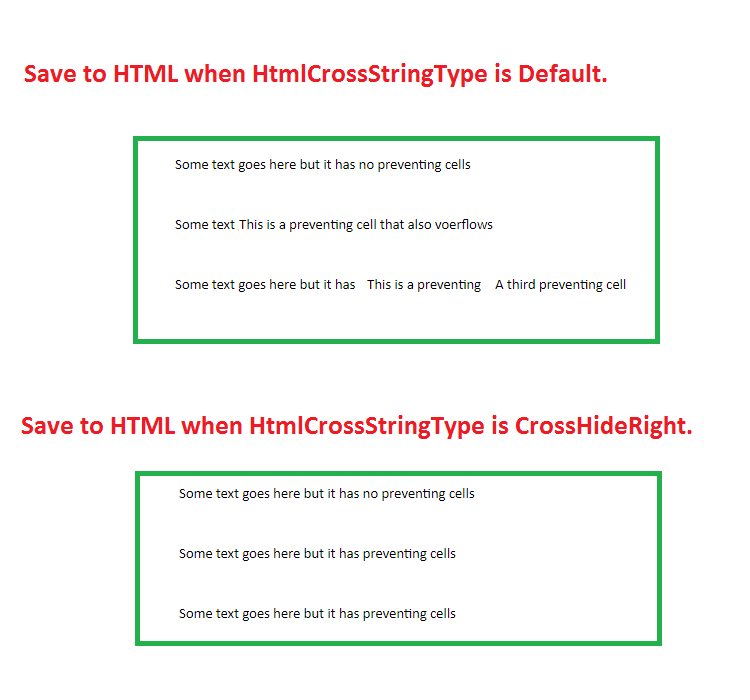

## **Possible Usage Scenarios**

When you save your Excel file to HTML, you can specify different cross types for cell strings. By default, Aspose.Cells generates HTML as per Microsoft Excel, but when you change the cross type to [**CrossHideRight**](https://reference.aspose.com/cells/go-cpp/htmlcrosstype), it hides all the strings on the right side of the cell that are overlaid or overlapping with the cell string.

## **Hiding Overlaid Content with CrossHideRight while saving to HTML**

The following sample code loads the [sample Excel file](64716894.xlsx) and saves it to [output HTML](64716893.zip) after setting the [**HtmlSaveOptions.GetHtmlCrossStringType()**](https://reference.aspose.com/cells/go-cpp/htmlsaveoptions/gethtmlcrossstringtype/) to [**CrossHideRight**](https://reference.aspose.com/cells/cpp/aspose.cells/htmlcrosstype). The screenshot explains how [**CrossHideRight**](https://reference.aspose.com/cells/cpp/aspose.cells/htmlcrosstype) affects the output HTML compared with the default output.

## **Sample Code**

