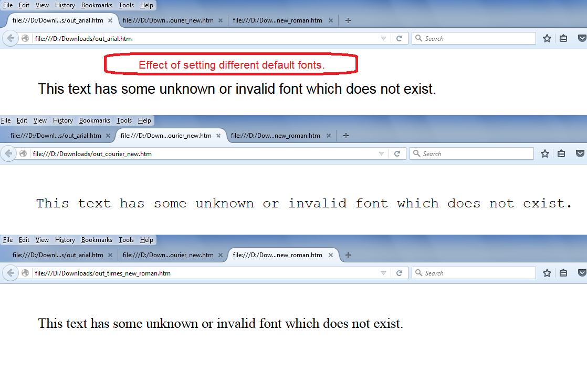

---  
title: Set Default Font while rendering spreadsheet to HTML with Golang via C++  
linktitle: Set Default Font while rendering spreadsheet to HTML  
type: docs  
weight: 370  
url: /go-cpp/set-default-font-while-rendering-spreadsheet-to/  
description: Learn how to set default font while rendering spreadsheet to HTML using Aspose.Cells for C++.  
---  

{}  

Aspose.Cells allows you to set the default font while rendering a spreadsheet to HTML. Use the [**HtmlSaveOptions.GetDefaultFontName()**](https://reference.aspose.com/cells/go-cpp/htmlsaveoptions/getdefaultfontname/) method for this purpose. This property is useful when some cells in a spreadsheet specify invalid or non‑existent fonts; those cells will be rendered using the font defined by the [**HtmlSaveOptions.GetDefaultFontName()**](https://reference.aspose.com/cells/go-cpp/htmlsaveoptions/getdefaultfontname/) property.  

{}  

## Set Default Font while rendering spreadsheet to HTML  

The following sample code creates a workbook, adds some text to cell B4 of the first worksheet, and sets its font to an unknown or non‑existent font. It then saves the workbook as HTML while specifying different default font names such as Courier New, Arial, Times New Roman, etc.  

The screenshot shows the effect of setting different default font names via the [**HtmlSaveOptions.GetDefaultFontName()**](https://reference.aspose.com/cells/go-cpp/htmlsaveoptions/getdefaultfontname/) property.  

  

The code generates the [output HTML file with Courier New](5115516), the [output HTML with Arial](5115518), and the [output HTML file with Times New Roman](5115517).  

## Sample Code  

