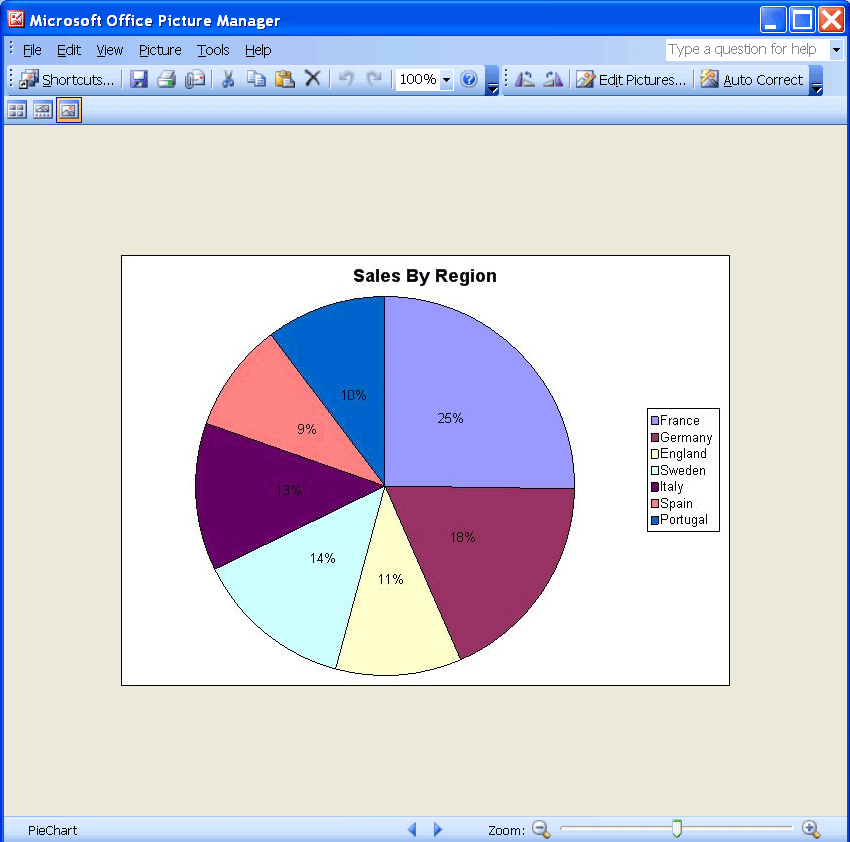

{}

Charts are visually appealing and make it easy for users to see comparisons, patterns, and trends in data. For instance, rather than analyzing columns of worksheet numbers, a chart shows at a glance whether sales are falling or rising, or how actual sales compare to projected sales. People are frequently asked to present statistical and graphical information in an easy-to-understand and easy-to-maintain manner. A picture helps.

Sometimes, charts are needed in an application or web pages. Or they might be needed for a Word document, a PDF file, a PowerPoint presentation, or some other application. In each case, you want to render the chart as an image so that you can use it elsewhere.

{}

## **Converting Charts to Images**

In the examples here, a pie chart and a column chart are converted to images.

### **Converting a Pie Chart to an Image File**

First, create a pie chart in Microsoft Excel and then convert it to an image file with Aspose.Cells. The code in this example creates an EMF image based on the pie chart in the template Microsoft Excel file.

|**Output: pie chart image**|
| :- |
||

1. Create a pie chart in Microsoft Excel:
   1. Open a new workbook in Microsoft Excel.
   1. Input some data into a worksheet.
   1. Create a pie chart based on the data.
   1. Save the file.

|**The input file.**|
| :- |
||

1. Download and install Aspose.Cells:
   1. [Download Aspose.Cells for C++](https://downloads.aspose.com/cells/go-cpp/).
   1. Install it on your development computer.

All [Aspose](http://www.aspose.com/) components work in evaluation mode when first installed. The evaluation mode has no time limit and it only injects watermarks into output documents.

1. Create a project:
   1. Start your C++ development environment (e.g., Visual Studio).
   1. Create a new console application.
   1. Add a reference to Aspose.Cells. This project uses Aspose.Cells, so add a reference to the Aspose.Cells library.
   1. Write the code that finds and converts the chart. Below is the code used by the component to accomplish the task. Very few lines of code are used.


### **Converting a Column Chart to an Image File**

First, create a column chart in Microsoft Excel and convert it to an image file, as above. After executing the sample code, a JPEG file is created based on the column chart in the template Excel file.

|**Output file: a column chart image.**|
| :- |
||

1. Create a column chart in Microsoft Excel:
   1. Open a new workbook in Microsoft Excel.
   1. Input some data into a worksheet.
   1. Create a column chart based on the data.
   1. Save the file.

|**Input file.**|
| :- |
||

1. Set up a project, with references, as described above.
1. Convert the chart to an image dynamically. Following is the code used by the component to accomplish the task. The code is similar to the previous one:

