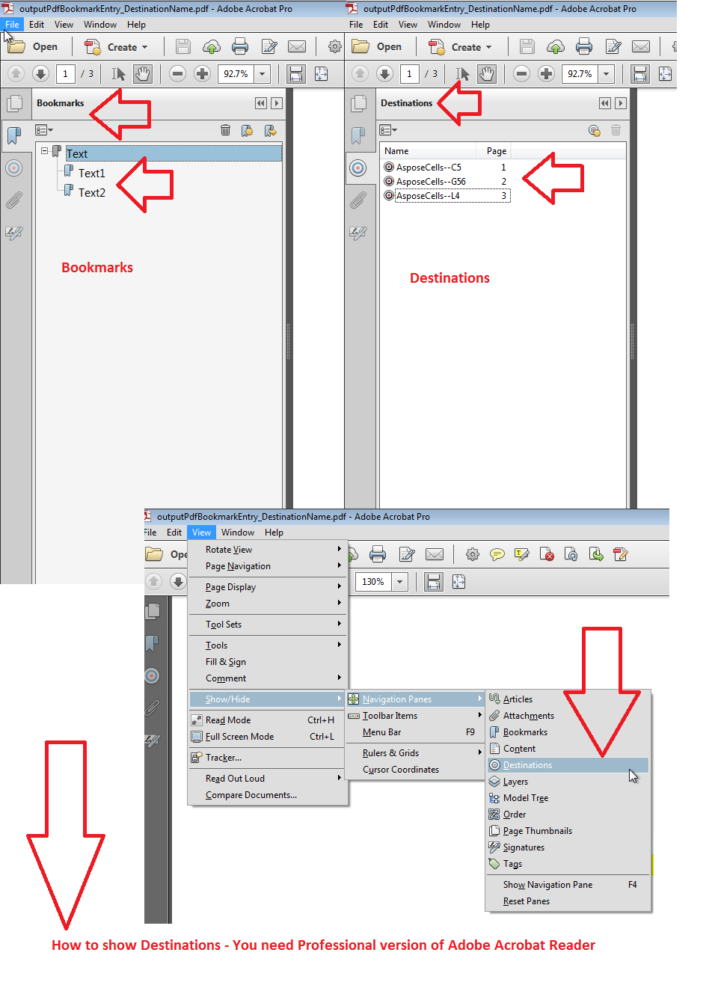

## **Possible Usage Scenarios**

Named Destinations are special kinds of bookmarks or links in PDF that do not depend on PDF pages. It means, if pages are added or deleted from PDF, bookmarks may become invalid but named destinations will remain intact. To create Named Destination, please set the [**PdfBookmarkEntry.GetDestinationName()**](https://reference.aspose.com/cells/go-cpp/pdfbookmarkentry/getdestinationname/) property.

## **Add PDF Bookmarks with Named Destinations**

Please see the following sample code, its [source Excel file](50528348.xlsx), and its [output PDF file](50528349.pdf). The screenshot shows the bookmarks and named destinations inside the output PDF. The screenshot also describes how to view Named Destinations and that you need Professional version of Acrobat Reader.

## **Sample Code**

