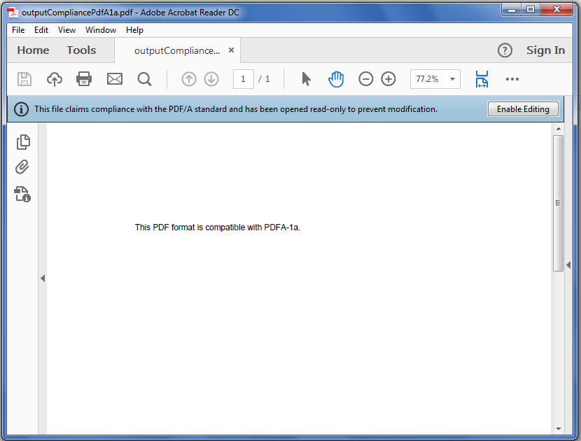

---  
title: Convert Excel file to PDF format compatible with PDFA-1a with Golang via C++  
linktitle: Convert Excel file to PDF format compatible with PDFA-1a  
type: docs  
weight: 130  
url: /go-cpp/convert-excel-file-to-pdf-format-compatible-with-pdfa-1a/  
description: Learn how to convert Excel files to PDF/A-1a compliant PDF format using Aspose.Cells with Golang via C++.  
---  

## **Possible Usage Scenarios**  

PDF/A is a unique flavor of PDF designed for the long‑term preservation of documents. PDF/A is an ISO‑standardized version of the Portable Document Format (PDF) which is an archival format of PDF that embeds all fonts used in the document within the PDF file. PDF/A differs from PDF by prohibiting features such as font linking (as opposed to font embedding) and encryption. Aspose.Cells enables you to save Excel files to PDF/A‑compliant PDF files (PDF/A‑1a, PDF/A‑1b, PDF/A‑2a, PDF/A‑2b, PDF/A‑2u, PDF/A‑3a, PDF/A‑2ab, and PDF/A‑3u are supported). This topic describes how to save the Excel workbook to a PDF/A‑compliant (PDF/A‑1a) PDF file.  

## **Convert Excel file to PDF Format Compatible with PDF/A-1a**  

Developers may use the [**PdfSaveOptions**](https://reference.aspose.com/cells/go-cpp/pdfsaveoptions/) class to set different attributes for the conversion. Setting different properties of the [**PdfSaveOptions**](https://reference.aspose.com/cells/go-cpp/pdfsaveoptions/) class gives you control over the print, font, security, and compression settings for the output PDF. The most important property is [**PdfSaveOptions.GetCompliance()**](https://reference.aspose.com/cells/go-cpp/pdfsaveoptions/getcompliance/), which enables you to save Excel files to PDF/A‑compliant PDF files.  

The following sample code demonstrates how to convert an Excel file to a PDF format compatible with PDF/A‑1a. Please see its [output PDF](outputCompliancePdfA1a.pdf) as well as the screenshot for reference.  

## **Screenshot**  

  

## **Sample Code**  

