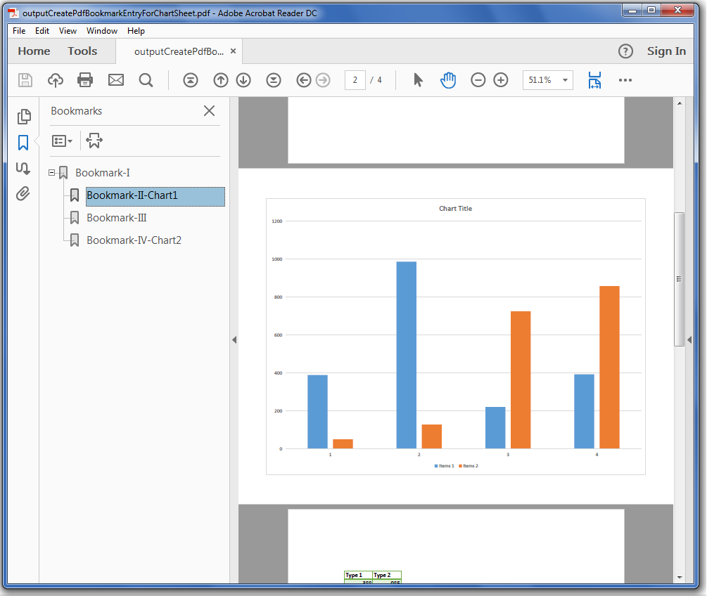

## **Possible Usage Scenarios**

Earlier, Aspose.Cells would create [**PdfBookmarkEntry**](https://reference.aspose.com/cells/go-cpp/pdfbookmarkentry/) for a normal sheet. But now Aspose.Cells can also create [**PdfBookmarkEntry**](https://reference.aspose.com/cells/go-cpp/pdfbookmarkentry/) for a chart sheet. Since a chart sheet does not have any cells other than cell A1, it will create a [**PdfBookmarkEntry**](https://reference.aspose.com/cells/go-cpp/pdfbookmarkentry/) for cell A1 only.

## **Create PdfBookmarkEntry for Chart Sheet**

The following sample code loads the [sample Excel file](61767756.xlsx) which has four sheets. Two of them are normal sheets and the other two are chart sheets. It creates four bookmark entries as follows:

- Bookmark-I
- Bookmark-II-Chart1
- Bookmark-III
- Bookmark-IV-Chart2

The following screenshot shows the [output PDF](61767757.pdf) generated by the sample code as a reference.

## **Sample Code**

