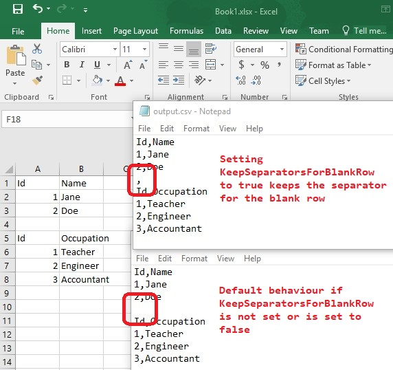

## **Keep Separators for Blank Rows while exporting spreadsheets to CSV format**

Aspose.Cells provides the ability to keep line separators while converting spreadsheets to CSV format. For this, you may use the [**GetKeepSeparatorsForBlankRow()**](https://reference.aspose.com/cells/go-cpp/txtsaveoptions/getkeepseparatorsforblankrow/) property of the [**TxtSaveOptions**](https://reference.aspose.com/cells/cpp/aspose.cells/txtsaveoptions/) class. [**GetKeepSeparatorsForBlankRow()**](https://reference.aspose.com/cells/go-cpp/txtsaveoptions/getkeepseparatorsforblankrow/) is a boolean property. To keep the separators for blank lines while converting the Excel file to CSV, set the [**GetKeepSeparatorsForBlankRow()**](https://reference.aspose.com/cells/go-cpp/txtsaveoptions/getkeepseparatorsforblankrow/) property to **true**.

The following sample code loads the [source Excel file](84378743.xlsx). It sets the [**TxtSaveOptions.GetKeepSeparatorsForBlankRow()**](https://reference.aspose.com/cells/go-cpp/txtsaveoptions/getkeepseparatorsforblankrow/) property to **true** and saves it as [output.csv](84378744.csv). The screenshot shows the comparison between the source Excel file, the default output generated while converting the spreadsheet to CSV, and the output generated by setting [**GetKeepSeparatorsForBlankRow()**](https://reference.aspose.com/cells/go-cpp/txtsaveoptions/getkeepseparatorsforblankrow/) to **true**.

## **Sample Code**

