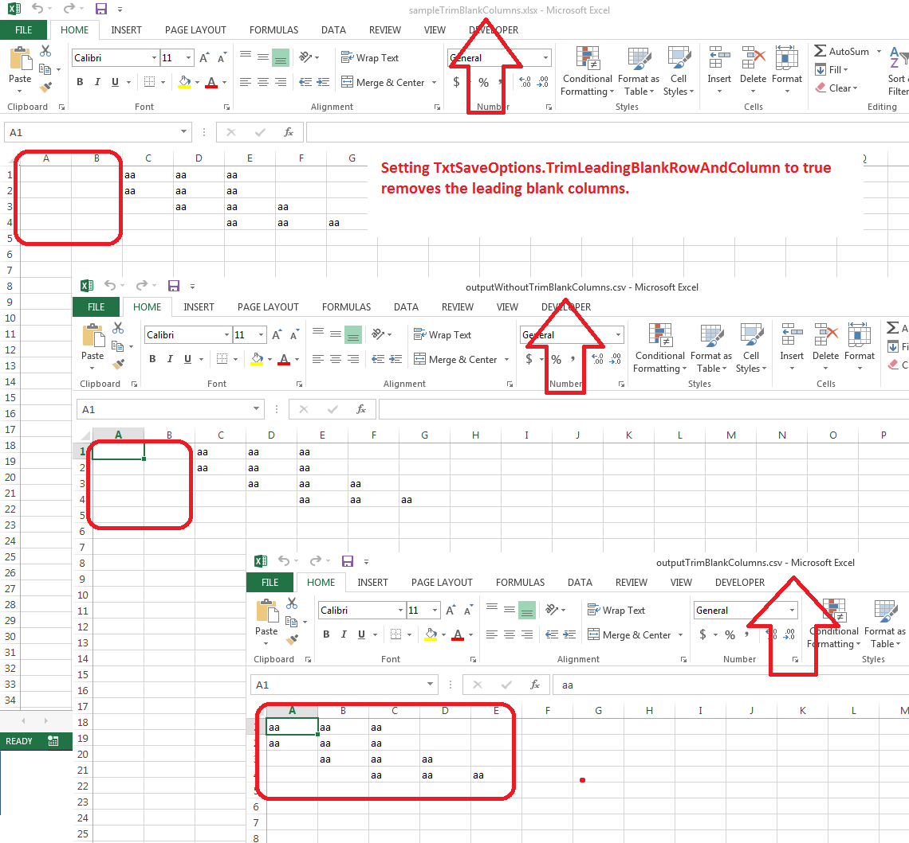

## **Possible Usage Scenarios**

Sometimes, your Excel or CSV file has leading blank columns or rows. For example, consider this line:



 ,,,data1,data2



Here the first three cells or columns are blank. When you open such a CSV file in Microsoft Excel, it discards these leading blank rows and columns.

By default, Aspose.Cells does not discard leading blank columns and rows on saving, but if you want to remove them just like Microsoft Excel does, Aspose.Cells provides [**TxtSaveOptions.GetTrimLeadingBlankRowAndColumn()**](https://reference.aspose.com/cells/go-cpp/txtsaveoptions/gettrimleadingblankrowandcolumn/) property. Please set it to **true** and then all the leading blank rows and columns will be discarded on saving.

{}

Prior to the release of Aspose.Cells for C++ 20.4, the default value of [**TxtSaveOptions.GetTrimLeadingBlankRowAndColumn()**](https://reference.aspose.com/cells/go-cpp/txtsaveoptions/gettrimleadingblankrowandcolumn/) was **false**. Since the 20.4 release, the default value of [**TxtSaveOptions.GetTrimLeadingBlankRowAndColumn()**](https://reference.aspose.com/cells/go-cpp/txtsaveoptions/gettrimleadingblankrowandcolumn/) is **true**.

{}

## **Trim Leading Blank Rows and Columns while exporting spreadsheets to CSV format**

The following sample code loads the [source Excel file](sampleTrimBlankColumns.xlsx) which has two leading blank columns. It first saves the Excel file in CSV format without any changes and then sets [**TxtSaveOptions.GetTrimLeadingBlankRowAndColumn()**](https://reference.aspose.com/cells/go-cpp/txtsaveoptions/gettrimleadingblankrowandcolumn/) property to **true** and saves it again. The screenshot shows the [source Excel file](sampleTrimBlankColumns.xlsx), [output CSV file without trimming](outputWithoutTrimBlankColumns.csv), and the [output CSV file with trimming](outputTrimBlankColumns.csv).

## **Sample Code**

